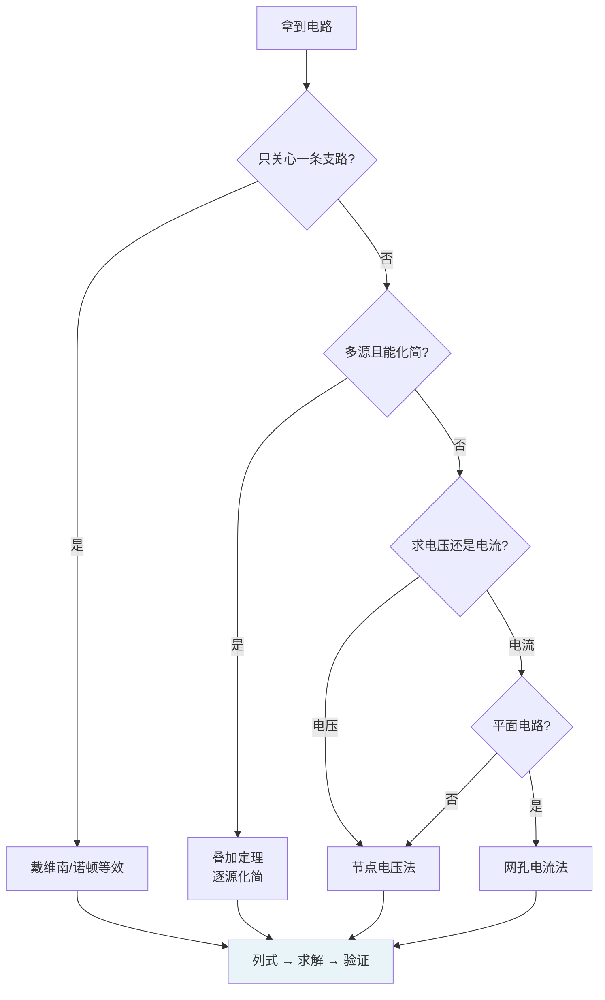
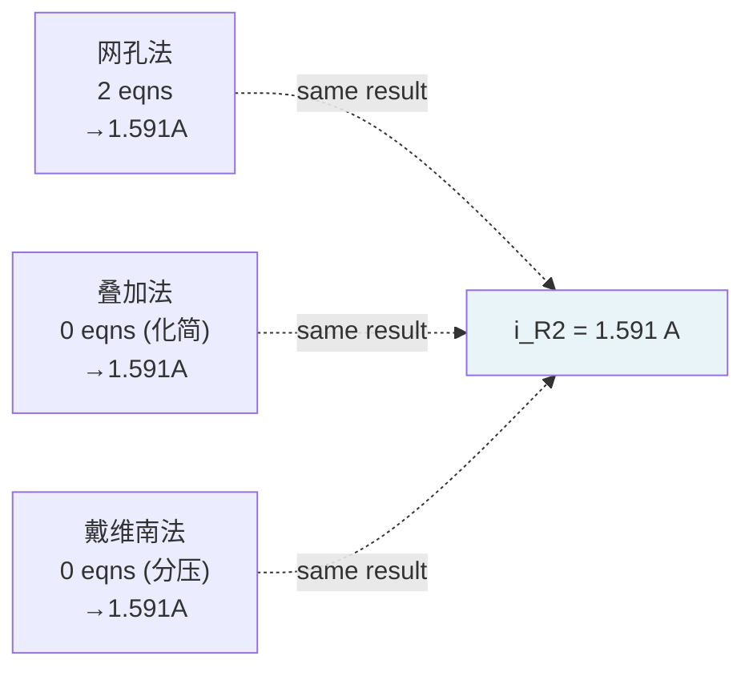

---
tags:
  - 电路学
  - 电路分析方法
  - 实践指南
  - 课程笔记
date: 2026-09-08
aliases:
  - 电路分析方法实践
  - Circuit Analysis Methods in Practice
  - 网孔电流法
  - Mesh Current Method
  - 节点电压法
  - Node Voltage Method
  - 支路电流法
  - Branch Current Method
  - 电路分析方法选型
  - 电路分析实战
---

# Circuit Analysis Methods in Practice（电路分析方法实战）

> [!NOTE] 本笔记定位
> [[Basic Circuit Analysis Method|基本电路分析法]] 讲了 Method 1–3 的**理论框架**；本笔记是**实战指南**——拿到一个电路，怎么选方法、怎么列式、怎么算到底。把 [[Kirchhoff's Laws|KCL/KVL]]、[[Superposition Theorem|叠加]]、[[Thevenin's Theorem|戴维南]] / [[Norton's Theorem|诺顿]] 串成一套可操作的工程流程。

---

## 一、方法总览与选型决策 (Which Method When

> [!IMPORTANT] 五种方法一张表
> 
> | 方法 | 核心 | 何时用 | 未知数规模 | 关键动作 |
> | :--- | :--- | :--- | :--- | :--- |
> | **支路电流法** (Branch Current) | KCL + KVL 原始版 | 教科书定义、小电路 | 大（= 支路数 $b$） | 每条支路一个 $i_k$，KCL + KVL 全写 |
> | **网孔电流法** (Mesh Current) | KVL | 平面电路、要求的量是电流 | 小（= 网孔数 $m$） | 每个网孔一个假想电流 $I_k$，仅写 KVL |
> | **节点电压法** (Node Voltage) | KCL | 要求的量是电压、节点少 | 小（= 节点数 $n-1$） | 每个非地节点一个 $e_k$，仅写 KCL |
> | **叠加定理** (Superposition) | 线性 = 可拆 | 多源线性电路 | 每次一个源 | 其他电压源短路、电流源开路 |
> | **戴维南/诺顿** (Thévenin/Norton) | 端口等效 | 只关心某一条支路 | 2（$V_{Th}$, $R_{Th}$） | 求开路电压 + 求等效电阻 |

> [!TIP] 选型口诀
> - **求全部电流** → 网孔法（平面电路）或支路法（非平面/小电路）
> - **求全部电压** → 节点法
> - **求某一支路** → 戴维南/诺顿
> - **多源、能化简** → 叠加定理
> - **什么都不知道** → 节点法（最通用，SPICE 也用它）

> [!NOTE] 支路数、网孔数、节点数的关系
> 对平面连通电路，记 $b$ = 支路数，$n$ = 节点数，$m$ = 网孔数，则有：
> $$b = m + (n - 1)$$
> - 支路法未知数 = $b$（最多）
> - 网孔法未知数 = $m$（比 $b$ 少 $n-1$ 个）
> - 节点法未知数 = $n-1$（比 $b$ 少 $m$ 个）
>
> 所以网孔法和节点法都是对支路法的**降维**——通过巧妙选取未知量，预先吸收掉一部分方程。

---

## 二、支路电流法 (Branch Current Method)

> [!IMPORTANT] 本质：最朴素的 KCL + KVL
> 每条支路指定一个电流 $i_k$（方向自定），然后：
> 1. 对每个**独立节点**写 KCL（$n-1$ 个方程）
> 2. 对每个**独立网孔**写 KVL（$m$ 个方程）
> 3. 代入元件定律（$v = iR$ 等）
> 4. 联立 $(n-1) + m = b$ 个方程解 $b$ 个支路电流

### 2.1 步骤

1. 标定每条支路的电流方向（任意，解出来负号表示反方向）
2. 对 $n-1$ 个节点写 KCL
3. 对 $m$ 个网孔写 KVL（用 $v=iR$ 把电压换成电流）
4. 解 $b$ 个方程

### 2.2 实例

以下面电路为例（见 [[Basic Circuit Analysis Method]] 的 Demo Circuit）：5 条支路、4 个节点 → $b=5$，$n-1=3$，$m=2$（但桥式有 3 个网孔）。

> [!WARNING] 暴力法的代价
> 5 支路 → 5 个电流未知数 → 5 个方程。看似不多，但如果电路有 20 条支路，就要列 20 个方程——这就是为什么工程上几乎不用支路法。理解它的**意义**在于：它是所有其他方法的"母体"。

详见 [[Basic Circuit Analysis Method#3. Method 1 — Basic KVL/KCL Method (暴力法)|Method 1 暴力法]] 的完整推导。

---

## 三、网孔电流法 (Mesh Current Method) ★ 求电流首选

> [!IMPORTANT] 核心：假想网孔电流 + 只写 KVL
> 给每个**网孔**指定一个**假想回路电流** $I_k$（通常取顺时针方向），然后**只对每个网孔写 KVL**——不需要写 KCL！因为网孔电流自动满足 KCL（每个节点的流入 = 流出，来自相邻网孔的电流一进一出）。

### 3.1 为什么网孔电流自动满足 KCL？

节点上有两条支路来自不同网孔：$I_1$ 从左流入流出，$I_2$ 从右流入流出。在共享支路上，实际电流 = $I_1 - I_2$（代数和）。无论 $I_1, I_2$ 取何值，该节点的 KCL 恒成立——因为"从 $I_1$ 流入的"必然等于"从 $I_1$ 流出的"（闭合回路）。

### 3.2 步骤

1. 标定每个网孔的电流方向（统一取顺时针）
2. 对每个网孔写 KVL：$\sum v_k = 0$
3. 用元件定律把 $v$ 换成 $I$：注意共享支路上的电流是**两网孔电流之差**
4. 解 $m$ 个方程

### 3.3 实战例题：双网孔电路

![[two_mesh_circuit.svg|500]]

> [!EXAMPLE] 双网孔电路完整求解
> 电路参数：$V_1 = 10\,\text{V}$，$R_1 = 2\,\Omega$，$R_2 = 4\,\Omega$，$R_3 = 6\,\Omega$，$V_2 = 5\,\text{V}$。求各支路电流。
>
> **Step 1 — 标定网孔电流**：$I_1$（左网孔，顺时针），$I_2$（右网孔，顺时针）。
>
> **Step 2 — 列 KVL**（沿每个网孔绕行一周，遇元件压降用 $v = iR$）：
>
> **Mesh 1**（$V_1 \to R_1 \to R_2$）：
> $$-V_1 + R_1\,I_1 + R_2\,(I_1 - I_2) = 0$$
> 注意 $R_2$ 上的电流是 $I_1 - I_2$（$I_1$ 顺时针流过 $R_2$ 向下，$I_2$ 也顺时针流过 $R_2$ 向上 → 方向相反）。
>
> **Mesh 2**（$R_2 \to R_3 \to V_2$）：
> $$R_2\,(I_2 - I_1) + R_3\,I_2 + V_2 = 0$$
> 这里 $R_2$ 上电流是 $I_2 - I_1$（$I_2$ 方向为准）。$V_2$ 从负到正（绕行方向先遇 + 端）→ 写 $+V_2$。
>
> **Step 3 — 代入数值**：
> $$\begin{cases} -10 + 2I_1 + 4(I_1 - I_2) = 0 \\ 4(I_2 - I_1) + 6I_2 + 5 = 0 \end{cases}$$
>
> **Step 4 — 整理**：
> $$\begin{cases} 6I_1 - 4I_2 = 10 \\ -4I_1 + 10I_2 = -5 \end{cases}$$
>
> **Step 5 — 解方程**（消元法）：
>
> 第 1 式 $\times 10$：$60I_1 - 40I_2 = 100$
>
> 第 2 式 $\times 4$：$-16I_1 + 40I_2 = -20$
>
> 相加：$44I_1 = 80 \Rightarrow \boxed{I_1 = \dfrac{80}{44} = 1.818\,\text{A}}$
>
> 代回第 1 式：$6(1.818) - 4I_2 = 10 \Rightarrow 4I_2 = 0.909 \Rightarrow \boxed{I_2 = 0.227\,\text{A}}$
>
> **Step 6 — 回求支路电流**：
> - $R_1$ 支路：$i_{R1} = I_1 = 1.818\,\text{A}$（向右）
> - $R_3$ 支路：$i_{R3} = I_2 = 0.227\,\text{A}$（向右）
> - $R_2$ 支路（共享）：$i_{R2} = I_1 - I_2 = 1.818 - 0.227 = 1.591\,\text{A}$（向下）
>
> **验证**（KCL @ 顶部节点）：$i_{R1} = i_{R2} + i_{R3}$？ $1.818 \approx 1.591 + 0.227 = 1.818$ ✓

> [!TIP] 网孔法 vs 支路法
> 同样的双网孔电路：支路法需 3 个电流 + 2 个 KCL + 2 个 KVL = 5 个方程；网孔法只需 2 个 KVL 方程。**每多一个节点，网孔法就少列一个方程。**

### 3.4 网孔法的标准形式

把 KVL 整理成矩阵形式：

$$\begin{bmatrix} R_{11} & R_{12} & \cdots \\ R_{21} & R_{22} & \cdots \\ \vdots & & \ddots \end{bmatrix} \begin{bmatrix} I_1 \\ I_2 \\ \vdots \end{bmatrix} = \begin{bmatrix} V_{s1} \\ V_{s2} \\ \vdots \end{bmatrix}$$

- $R_{kk}$：网孔 $k$ 内所有电阻之和（**自阻**，恒正）
- $R_{kj}$（$k\neq j$）：网孔 $k$ 与 $j$ 共享电阻之和的**负值**（**互阻**，一般取负——因为相邻网孔电流方向通常相反）
- $V_{sk}$：网孔 $k$ 内电压源代数和（沿绕行方向，遇 + 取正，遇 − 取负）

> [!NOTE] 对称性
> 电阻矩阵是对称的：$R_{kj} = R_{jk}$（共享电阻对两网孔的值相同）。这与节点法电导矩阵的对称性如出一辙。

---

## 四、节点电压法 (Node Voltage Method) ★ 求电压首选

> [!IMPORTANT] 核心：选参考节点 + 只写 KCL
> 选一个参考节点（地），给其余 $n-1$ 个节点标电压 $e_k$，然后**只写 KCL**——不需要写 KVL！因为节点电压定义已自动满足 KVL（任意两节点间的支路电压 = $e_a - e_b$）。

### 4.1 步骤（五步法）

1. 选参考节点（⊥），所有电压相对它测量
2. 给每个非参考节点标电压 $e_1, e_2, \ldots$
3. 对每个非参考节点写 KCL，用 $(e_a - e_b) \cdot G$ 替换支路电流
4. 整理成 $[G][e] = [s]$ 矩阵形式
5. 求解 $[e]$，再回求支路电流/电压

### 4.2 实战要点

详见 [[Basic Circuit Analysis Method#5. Method 3 — Node Analysis (节点法)|Method 3 节点法]] 的完整推导与 Old Faithful 例题。这里补充几个实战技巧：

> [!TIP] 电压源处理
> - **一端接地**：直接令另一端 $e = V_S$，该节点不写 KCL（已知量不列方程）。
> - **两端都不接地**（floating voltage source）：引入"超节点 (supernode)"——把跨在电压源两端的两个节点视为一个整体，写一个 KCL，再补 $e_b - e_a = V_S$。

> [!TIP] 电流源处理
> 电流源 $I_S$ 注入节点 → 直接作为**源项**移到等式右边。如果电流源两端电压未知，那正好——电流源天然提供电流值，不需要元件定律。

### 4.3 矩阵形式

$$[G][e] = [s] \qquad\text{即}\qquad \begin{bmatrix} G_{11} & G_{12} & \cdots \\ G_{21} & G_{22} & \cdots \\ \vdots & & \ddots \end{bmatrix} \begin{bmatrix} e_1 \\ e_2 \\ \vdots \end{bmatrix} = \begin{bmatrix} s_1 \\ s_2 \\ \vdots \end{bmatrix}$$

- $G_{kk}$：节点 $k$ 所有连接电导之和（**自导**，恒正）
- $G_{kj}$（$k\neq j$）：节点 $k$ 与 $j$ 之间直接电导的**负值**（**互导**）
- $s_k$：注入节点 $k$ 的源项（电压源 × 连接电导 + 电流源）

> [!NOTE] 网孔法与节点法的完美对偶
> | | 网孔电流法 | 节点电压法 |
> | :--- | :--- | :--- |
> | 定律 | KVL | KCL |
> | 未知量 | 网孔电流 $I_k$ | 节点电压 $e_k$ |
> | 矩阵 | 电阻矩阵 $[R]$ | 电导矩阵 $[G]$ |
> | 对角元素 | 自阻（+） | 自导（+） |
> | 非对角 | 互阻（−） | 互导（−） |
> | 源项 | 电压源 | 电流源 + $V \cdot G$ |
> | 自动满足 | KCL | KVL |

---

## 五、叠加定理实战 (Superposition in Practice)

> [!IMPORTANT] 核心操作：逐个源单独作用
> 线性电路中，多源共同作用 = 各源**单独作用**的代数和。每次只保留一个源：
> - 其他**电压源** → **短路**（用导线替换，$V=0$）
> - 其他**电流源** → **开路**（断开，$I=0$）
> - **受控源保留不动**（不能置零！）
> - 内阻保留。

### 5.1 步骤

1. 画 $N$ 个子电路（$N$ = 独立源个数），每次只保留一个独立源
2. 每个子电路多半能**串并联化简**（因为少了源就少了回路）
3. 分别求解目标量 $x^{(k)}$
4. 叠加：$x = x^{(1)} + x^{(2)} + \cdots + x^{(N)}$

### 5.2 实战例题

> [!EXAMPLE] 叠加法解双源电路
> 用 [[two_mesh_circuit.svg|上面双网孔电路]]，改用叠加法求解 $R_2$ 上的电流 $i_{R2}$。
>
> **子电路 1**：只留 $V_1 = 10\,\text{V}$，$V_2$ 短路。
>
> 此时 $R_2 \parallel R_3 = \dfrac{4 \times 6}{4+6} = 2.4\,\Omega$，与 $R_1 = 2\,\Omega$ 串联。
> $$i_{R1}^{(1)} = \frac{10}{2 + 2.4} = 2.273\,\text{A}$$
> $R_2$ 上的分流（$R_2 \parallel R_3$ 中 $R_2$ 分走 $\frac{R_3}{R_2+R_3}$）：
> $$i_{R2}^{(1)} = 2.273 \times \frac{6}{4+6} = 1.364\,\text{A} \quad\text{(向下)}$$
>
> **子电路 2**：只留 $V_2 = 5\,\text{V}$，$V_1$ 短路。
>
> 此时 $R_2 \parallel R_1 = \dfrac{4 \times 2}{4+2} = 1.333\,\Omega$，与 $R_3 = 6\,\Omega$ 串联。
> $$i_{R3}^{(2)} = \frac{5}{1.333 + 6} = 0.682\,\text{A}$$
> $R_2$ 上的分流（$R_2 \parallel R_1$ 中 $R_2$ 分走 $\frac{R_1}{R_1+R_2}$）：
> $$i_{R2}^{(2)} = 0.682 \times \frac{2}{2+4} = 0.227\,\text{A} \quad\text{(向下)}$$
>
> **叠加**：
> $$i_{R2} = i_{R2}^{(1)} + i_{R2}^{(2)} = 1.364 + 0.227 = 1.591\,\text{A}$$
>
> 与网孔法结果 $i_{R2} = I_1 - I_2 = 1.591\,\text{A}$ **完全一致** ✓

> [!TIP] 叠加法的优势
> 双源电路里，每个子电路都退化成简单串并联——不用解联立方程，只用 [[Resistive Networks|分压分流]] 就能搞定。源越多，叠加法的相对优势越大（前提是每次化简都容易）。

> [!WARNING] 叠加法不能叠加功率！
> 功率 $P = i^2 R$ 是电流的**二次函数**——不能写 $P = P^{(1)} + P^{(2)}$。必须先叠加电流/电压，再算功率。例如 $i_{R2}^2 R_2 \neq (i_{R2}^{(1)})^2 R_2 + (i_{R2}^{(2)})^2 R_2$。

---

## 六、戴维南/诺顿实战 (Thévenin/Norton in Practice)

> [!IMPORTANT] 核心：只关心一条支路 → 把其余部分等效为电源 + 电阻
> 1. 断开目标支路，从端口看进去的**开路电压** $V_{oc} = V_{Th}$
> 2. 求从端口看进去的**等效内阻** $R_{Th}$
> 3. 接回负载，用分压/分流一算到底

### 6.1 求 $V_{Th}$（开路电压）

断开负载，用任意方法（节点法/网孔法/叠加/串并联）求端口电压。开路 = 无电流流出 → 端口处支路电流为零。

### 6.2 求 $R_{Th}$（等效电阻）— 三种方法

| 方法         | 操作                                                           | 适用条件        |
| :--------- | :----------------------------------------------------------- | :---------- |
| **源置零法**   | 独立电压源短路、电流源开路，从端口看串并联                                        | 无受控源        |
| **开路-短路法** | $R_{Th} = V_{oc} / I_{sc}$                                   | 端口可短路       |
| **加压求流法**  | 端口加测试电压 $V_{test}$，求 $I_{test}$，$R_{Th} = V_{test}/I_{test}$ | 含受控源（受控源保留） |

### 6.3 实战例题

> [!EXAMPLE] 戴维南等效求负载电流
> 电路同上（[[two_mesh_circuit.svg|双网孔电路]]），从 $R_2$ 两端断开，把 $R_2$ 当负载，用戴维南等效求其电流。
>
> **Step 1 — 求 $V_{Th}$（$R_2$ 断开后的开路电压 $V_A$）**：
>
> 断开 $R_2$ 后，节点 A 通过 $R_1$ 连到 $V_1$、通过 $R_3$ 连到 $V_2$（两源负端共地）。$R_1$ 与 $R_3$ 形成**串联分压**通路：
> $$I_{path} = \frac{V_1 - V_2}{R_1 + R_3} = \frac{10 - 5}{2 + 6} = 0.625\,\text{A}$$
> $$\boxed{V_{Th} = V_A = V_1 - I_{path}\,R_1 = 10 - 0.625 \times 2 = 8.75\,\text{V}}$$
> 也可用叠加验证：$V_A = V_1\dfrac{R_3}{R_1+R_3} + V_2\dfrac{R_1}{R_1+R_3} = 10\times\frac{6}{8} + 5\times\frac{2}{8} = 8.75\,\text{V}$ ✓
>
> **Step 2 — 求 $R_{Th}$（两源置零，从端口看入）**：
>
> $V_1$ 短路、$V_2$ 短路 → $R_1$ 和 $R_3$ 均一端接 A、另一端接地 → 并联：
> $$\boxed{R_{Th} = R_1 \parallel R_3 = \frac{2 \times 6}{2 + 6} = 1.5\,\Omega}$$
>
> **Step 3 — 接回 $R_2$，用分压求电流**：
>
> $$\boxed{i_{R2} = \frac{V_{Th}}{R_{Th} + R_2} = \frac{8.75}{1.5 + 4} = \frac{8.75}{5.5} = 1.591\,\text{A}}$$
>
> 与网孔法 $i_{R2} = I_1 - I_2 = 1.591\,\text{A}$ **完全一致** ✓

> [!WARNING] 常见陷阱：误认为断开后 R₁/R₃ 无电流
> 断开 $R_2$ 后，$R_1$ 和 $R_3$ **并非各自开路**——它们通过 $V_1$、$V_2$ 和共地形成了一条串联通路。如果误以为"断开 $R_2$ 后 $R_1$ 无电流 → $V_A = V_1 = 10\,\text{V}$"，就会得到 $V_{Th} = 10\,\text{V}$（错！），进而 $i = 10/5.5 = 1.818\,\text{A}$（与网孔法不符）。
>
> **正确理解**：端口开路只意味着"没有电流从端口流出"，但电路**内部**的电流照常流通。

---

## 七、同一电路、三种方法的结果对比

> [!NOTE] 三法一致
> 对双网孔电路求 $R_2$ 上的电流 $i_{R2}$：
>
> | 方法 | 关键步骤 | $i_{R2}$ | 方程数 |
> | :--- | :--- | :--- | :--- |
> | 网孔电流法 | 2 个 KVL → $I_1=1.818, I_2=0.227$ | $I_1-I_2 = 1.591\,\text{A}$ | 2 |
> | 叠加定理 | 2 个子电路串并联化简 | $1.364+0.227 = 1.591\,\text{A}$ | 0（无联立） |
> | 戴维南等效 | $V_{Th}=8.75, R_{Th}=1.5$ | $8.75/5.5 = 1.591\,\text{A}$ | 0（分压） |

---

## 八、实战检查清单 (Practical Checklist)

> [!TIP] 列式前的检查
> 1. ✅ 画电路图，标好所有元件值和方向
> 2. ✅ 采用 AVD（[[Basic Circuit Analysis Method#4. 关联变量约定 AVD|关联变量约定]]），统一正负号
> 3. ✅ 确认电路是平面（能画在平面上无交叉）→ 可用网孔法
> 4. ✅ 确认有无受控源 → 有则叠加/戴维南的源置零法要特别处理

> [!TIP] 算完后的验证
> 1. ✅ 功率守恒：$\sum p = 0$（电源释放 = 电阻消耗 + 储能变化）
> 2. ✅ KCL 抽查：任取一个非参考节点，验证 $\sum i = 0$
> 3. ✅ KVL 抽查：任取一个回路，验证 $\sum v = 0$
> 4. ✅ 量纲一致：电压单位 V、电流单位 A、电阻单位 Ω
> 5. ✅ 符号合理：电阻电流方向使功率 $p>0$（吸收），电源功率 $p<0$（释放）

> [!WARNING] 最常见的错误
> 1. **符号混乱**：没统一 AVD，KVL 绕行方向和电流方向不一致 → 正负号全错
> 2. **受控源当独立源置零**：叠加法和戴维南法中，**受控源绝对不能置零**
> 3. **功率叠加**：功率是非线性量，不能叠加
> 4. **戴维南端口取错**：断开负载后，端口开路电压要取**负载两端**的电压，不是任意节点
> 5. **超节点忘记补约束**：含 floating voltage source 时只写超节点 KCL，忘了补 $e_b - e_a = V_S$

---

## 九、方法选择的工程直觉

> [!IMPORTANT] 大局观
> - **节点法**是电路仿真的"航母"——SPICE 用改进节点法（MNA），因为它对**任意拓扑**（平面/非平面）都适用，且矩阵稀疏、数值稳定。
> - **网孔法**在**手算**平面电路时最舒服——方程少、物理直觉强（"绕一圈电压和为零"）。
> - **叠加法**在**多源 + 可化简**时效率最高——每个子电路退化为简单串并联。
> - **戴维南/诺顿**在**系统设计**时最有价值——不需要知道负载细节，只需知道端口等效，就能预测任何负载下的行为。

> [!NOTE] 从方法到设计
> 工程师实际工作中，分析方法是工具，不是目标。真正的工作流是：
> 1. 用**戴维南等效**快速估算端口行为（这个放大器能驱动多大的负载？）
> 2. 用**节点法**做精确分析（SPICE 仿真）
> 3. 用**叠加法**分析噪声与干扰（信号源和噪声源分别分析再叠加）
> 4. 用**网孔法**在白板推导时快速验证（直觉检查）

---

## 相关笔记

- [[Basic Circuit Analysis Method]] —— Method 1–3 的理论框架（暴力法、组合规则、节点法）
- [[Kirchhoff's Laws]] —— KCL / KVL 的定义与物理来源
- [[Resistive Networks]] —— 串并联化简、分压分流（叠加法的基础）
- [[Superposition Theorem]] —— 叠加定理的完整推导与适用条件
- [[Thevenin's Theorem]] —— 戴维南定理的推导与端口等效
- [[Norton's Theorem]] —— 诺顿定理（戴维南的对偶）
- [[Maximum Power Transfer Theorem]] —— $R_L = R_{Th}$ 的最大功率传输条件
- [[Ohm's Law]] —— 所有电阻电路的基础 $v = iR$
- [[Wheatstone Bridge and Wye-Delta Transformation]] —— 拓扑变换技巧：桥式网络的 Y-Δ 化简（方法选型的补充武器）
- [[cs6.002x.1]] —— 电路原理知识树（主笔记）
