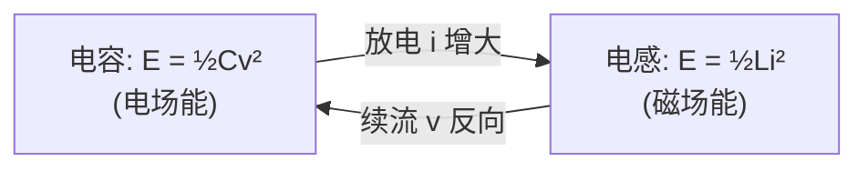

---
tags:
  - 电路学
  - 电磁学
  - 能量存储元件
  - 课程笔记
date: 2026-09-07
aliases:
  - 能量守恒
  - 电荷守恒
  - 磁通守恒
  - 通量守恒
  - 功率守恒
  - Energy Conservation
  - Charge Conservation
  - Flux Conservation
  - Power Conservation
---

# Energy and Charge Conservation（能量 / 电荷 / 磁通守恒）

> [!NOTE] 本笔记定位
> 把 [[Kirchhoff's Laws|KCL / KVL]] 与 [[Maxwell's Equations|麦克斯韦方程组]] 之间的"守恒关系"串起来：电荷守恒 ⇒ KCL、能量守恒 ⇒ KVL、磁通/链路守恒 ⇒ 电感行为。并看 [[Capacitor|电容]] 与 [[Inductor|电感]] 如何无损耗地储存与交换电磁能量。
> 与 [[cs6.002x.1|知识树]] 互链。

---

## 一、三条守恒的来龙去脉

在[[Lumped Matter Discipline|集总电路抽象 (LMD)]]下，三条宏观守恒律直接降级为电路的两条基本定律：

| 守恒律（场论） | 电路中的体现 | 对应定律 |
| :--- | :--- | :--- |
| **电荷守恒** (Charge Conservation) | 任一节点电荷不累积 ⇒ 流入=流出 | [[Kirchhoff's Laws#KCL\|KCL]] |
| **能量守恒** (Energy Conservation) | 沿任一回路走一圈能量不增不减 ⇒ 电压代数和=0 | [[Kirchhoff's Laws#KVL\|KVL]] |
| **磁通 / 链路守恒** (Flux / Linkage) | 电感电流不能突变、耦合线圈的磁通链关系 | [[Inductor\|电感]] 的 $\phi=Li$、互感 |

> [!IMPORTANT] 核心观点
> **KCL / KVL 不是"额外假设"，而是守恒律在集总电路里的投影。** 理解这一点，就能把"为什么节点电流和为零""为什么回路电压和为零"追到最底层——电荷与能量既不能凭空产生也不能凭空消失。

---

## 二、电荷守恒 ⇒ KCL

电荷连续性方程（微分形式）：
$$\frac{\partial \rho}{\partial t} + \nabla\cdot\mathbf{J} = 0$$

在集总节点上积分：流入节点的电流（即穿过包围该节点的闭合面的 $\mathbf{J}$）代数和等于节点内电荷的变化率。对**稳态 / 集总**节点，内部不存电荷 ⇒
$$\sum i_{\text{in}} = \sum i_{\text{out}} \quad\Longrightarrow\quad \text{KCL}$$

> [!TIP] 直觉
> 节点像一个有进有出的"水管接头"，水（电荷）不会在接头里凭空堆积，所以进多少出多少。

---

## 三、能量守恒 ⇒ KVL

电场是**保守场**（静电近似下），沿闭合回路的环量为零：
$$\oint \mathbf{E}\cdot d\mathbf{l} = 0 \quad\Longrightarrow\quad \sum v_k = 0 \quad\text{(KVL)}$$

对含时场，安培-麦克斯韦定律带来感应电动势，KVL 改写为含 $\frac{d\Phi}{dt}$ 的形式；在集总近似（尺寸 $\ll$ 波长）下仍退化为普通 KVL。

> [!NOTE] 与功率守恒的关系
> 整个电路的总吸收功率恒为零（吸收=释放）：
> $$\sum_n v_n i_n = 0$$
> 这是能量守恒的"瞬时"版本——电源释放的功率，恰好等于电阻耗散 + 储能元件增速率之和。

---

## 四、电容与电感中的能量（无损耗存储）

理想 [[Capacitor|电容]] 与 [[Inductor|电感]] 是**无损储能元件**，能量在"场"里存储、不发热：

| 元件 | 本构关系 | 储能 | 状态变量 |
| :--- | :--- | :--- | :--- |
| 电容 Capacitor | $q=Cv,\; i=C\dfrac{dv}{dt}$ | $E_C=\dfrac12 C v^2$ | $v_C$ |
| 电感 Inductor | $\phi=Li,\; v=L\dfrac{di}{dt}$ | $E_L=\dfrac12 L i^2$ | $i_L$ |

> [!IMPORTANT] 守恒的含义
> - **电荷守恒**体现在电容上：$q$ 连续变化（除非有冲击电流），$v_C$ 不能突变。
> - **磁通链守恒**体现在电感上：$\phi=Li$ 连续，$i_L$ 不能突变。
> - 能量 $E_C,E_L$ 在理想情况下**永远守恒**（不增不减，只和与外电路交换）。

---

## 五、LC 振荡：能量在电场与磁场间"来回倒手"

把 [[Capacitor|电容]] 与 [[Inductor|电感]] 并联（或串联）构成 **LC 谐振腔 (tank)**，没有电阻时：

- 电容放电 → 电流增大 → 电感存磁场；
- 电感续流 → 电容反向充电 → 电场回升；
- 总电磁能量 $E_{\text{tot}} = \tfrac12 C v^2 + \tfrac12 L i^2 = \text{const}$（守恒）。

这就是 [[Second-Order Transients|二阶暂态]] 里无阻尼振荡的来源，也是 [[Resonance|谐振]] 的物理本质。

![[lc_oscillator.svg]]

> [!TIP] 承上启下
> 一旦引入电阻 $R$，能量就被耗散，振荡衰减为 [[First-Order Transients|一阶]] / [[Second-Order Transients|二阶]] 暂态——守恒律仍在，只是"总能量不再恒定"。

---

## 六、与麦克斯韦方程组的接口

| 电路定律 | 对应的麦克斯韦方程 |
| :--- | :--- |
| KCL | 电荷连续性 $\nabla\!\cdot\!\mathbf{J} = -\partial\rho/\partial t$ |
| KVL | 法拉第定律的保守场特例 $\nabla\times\mathbf{E}=0$（静电） |
| 电容 $q=Cv$ | 高斯定律 $Q=\varepsilon EA$ ⇒ $C=\varepsilon A/d$ |
| 电感 $v=L\,di/dt$ | 法拉第定律 $v=-d\Phi/dt$ 与安培定律的磁链形式 |

> [!NOTE] 学习路线
> 想从"集总电路"一路追到"场"，顺序为：[[Lumped Matter Discipline|LMD]] → [[Kirchhoff's Laws|KCL/KVL]] → 本笔记（守恒投影） → [[Maxwell's Equations|麦克斯韦方程组]]。储能元件本身见 [[Capacitor]] / [[Inductor]]。

---

## 相关笔记

- [[Kirchhoff's Laws]] —— KCL（电荷守恒）/ KVL（能量守恒）的直接来源
- [[Maxwell's Equations]] —— 守恒律的场论根
- [[Lumped Matter Discipline]] —— 守恒律能在电路层面成立的"集总"前提
- [[Capacitor]] / [[Inductor]] —— 具体储能元件与各自的能量/状态变量
- [[First-Order Transients]] / [[Second-Order Transients]] —— 含 $R$ 后能量如何耗散（暂态）
- [[Resonance]] —— LC 能量守恒的频域表现（谐振）
- [[cs6.002x.1]] —— 电路原理知识树（主笔记）
