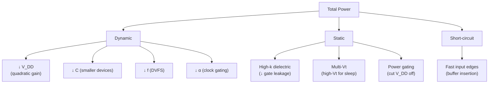

---
tags:
  - 电路学
  - 动态电路
  - 数字电路
  - 功耗分析
  - 课程笔记
date: 2026-09-08
aliases:
  - 数字电路的能量与功率
  - Energy and Power in Digital Circuits
  - Digital Power
  - CMOS Power
  - Dynamic Power
  - Static Power
  - 动态功耗
  - 静态功耗
  - Power-Delay Product
  - 功耗延迟积
  - RC Energy Loss
---

# Energy and Power in Digital Circuits（数字电路的能量与功率）

> [!NOTE] 本笔记定位
> 对应教材 **Ch.11 *Energy and Power in Digital Circuits***。承接 [[First-Order Transients|一阶暂态]] 中 RC 充放电的暂态分析，聚焦**能量去哪了**：每次 0→1 翻转都要给负载电容充电，每次 1→0 都要放电——这些过程消耗的能量构成了数字电路的**动态功耗 (dynamic power)**。同时，[[The MOSFET Switch|NMOS 开关]] 的静态导通电流构成**静态功耗 (static power)**。本笔记系统梳理 RC 能量损耗、NMOS vs CMOS 功耗对比、功耗-延迟积等核心概念。
> 与 [[cs6.002x.1|知识树]] 互链。

---

## 一、RC 充电的能量分析

> [!IMPORTANT] 经典结论：50% 能量损耗
> 给电容 $C$ 从 0 充到 $V_S$，电压源提供 $CV_S^2$ 的能量，电容只存了 $\frac{1}{2}CV_S^2$，另外 $\frac{1}{2}CV_S^2$ 全被电阻 $R$ 消耗——**与 $R$ 的大小无关**。

### 1.1 推导

[[First-Order Transients|一阶暂态]] 中已知充电时 $v_C(t) = V_S(1-e^{-t/\tau})$，$i(t) = \frac{V_S}{R}e^{-t/\tau}$，$\tau = RC$。

**电容储能**（终态）：
$$E_C = \frac{1}{2}CV_S^2$$

**电阻耗能**（积分）：
$$E_R = \int_0^\infty i^2 R\,dt = \int_0^\infty \frac{V_S^2}{R}e^{-2t/\tau}\,dt = \frac{V_S^2}{R}\cdot\frac{\tau}{2} = \frac{1}{2}CV_S^2$$

**电源供能**（总）：
$$E_S = \int_0^\infty V_S \cdot i\,dt = V_S \cdot CV_S = CV_S^2$$

验证：$E_S = E_C + E_R$ ✓

![[rc_energy_loss.svg|500]]

> [!WARNING] "与 R 无关"是物理本质，不是巧合
> 无论用大电阻慢充还是小电阻快充，电阻都消耗掉 $\frac{1}{2}CV_S^2$。物理根源：电阻上的功率 $p_R = i^2R$，电阻越大电流越小但持续时间越长、电阻越小电流越大但持续时间越短——积分后结果恰好相同。能量被分配到"场"（电容）和"热"（电阻）的比例永远 50:50。

### 1.2 放电过程

电容从 $V_S$ 放电到 0 时，电容储存的 $\frac{1}{2}CV_S^2$ **全部**被电阻消耗。所以一次充放电循环（0→$V_S$→0）电阻总耗能：

$$E_{\text{cycle}} = \frac{1}{2}CV_S^2 + \frac{1}{2}CV_S^2 = CV_S^2$$

---

## 二、动态功耗 (Dynamic Power)

> [!IMPORTANT] 动态功耗公式
> 每次完整翻转（0→1→0 或 1→0→1）消耗 $CV_{DD}^2$。若时钟频率为 $f$，则平均动态功耗：
> $$\boxed{P_{\text{dyn}} = \alpha\, C\, V_{DD}^2\, f}$$
> 其中 $\alpha$ 是**活动因子 (activity factor)**——每个时钟周期内实际发生翻转的节点比例（典型 $0.1\sim 0.5$）。

### 2.1 各项的工程意义

| 参数 | 含义 | 优化方向 |
| :--- | :--- | :--- |
| $C$ | 负载电容（门输入 + 寄生） | 减小器件尺寸、短走线 |
| $V_{DD}$ | 电源电压 | 降低电压（但影响速度） |
| $f$ | 时钟频率 | 降频（DVFS） |
| $\alpha$ | 翻转活动率 | 门控时钟、关闭空闲模块 |

> [!TIP] 降低 $V_{DD}$ 是最有效的
> $P_{\text{dyn}} \propto V_{DD}^2$——电压减半，功耗降到 1/4。这就是为什么现代处理器不断降低供电电压（从 5V → 3.3V → 1.2V → 0.9V 甚至更低）。但 $V_{DD}$ 下降会增大延迟（$R_{ON}$ 增大、$V_{OV}$ 减小），形成速度-功耗折中。

### 2.2 与传播延迟的折中 (Power-Delay Product)

$$\text{PDP} = P_{\text{dyn}} \times t_{pd} \approx \alpha C V_{DD}^2 f \cdot R_{ON} C_L$$

> [!NOTE] PDP 的物理含义
> PDP（Power-Delay Product）= 平均功率 × 延迟（量纲为能量），衡量"开关一次的能效"。理想的逻辑门应同时低功耗、低延迟。通常在电路最高翻转率（$f \sim 1/(2t_{pd})$，此时 $f \cdot t_{pd} \approx$ 常数）下评估，PDP 才与频率无关，成为反映工艺/设计水平的内在指标。

---

## 三、NMOS 反相器的静态功耗

> [!IMPORTANT] NMOS 的致命弱点
> 电阻上拉 NMOS 反相器在输出 "0" 时，$V_S$ 通过 $R_L$ 和 $R_{ON}$ 形成直流通路，**持续消耗功率**：
> $$P_{\text{static, NMOS}} = \frac{V_S^2}{R_L + R_{ON}} \approx \frac{V_S^2}{R_L} \quad (R_{ON} \ll R_L)$$

这在数字电路中是不可接受的——即使不翻转也持续耗电。一个芯片含上百万个门，静态功耗将灾难性。

### 3.1 能量来源分解

| NMOS 反相器状态 | 功耗来源 | 性质 |
| :--- | :--- | :--- |
| 输出 = "0"（nMOS 导通） | $V_S \to R_L \to R_{ON} \to$ GND 直流 | **静态**，持续 |
| 输出 = "1"（nMOS 截止） | $R_L$ 上拉，无直流通路 | 静态 ≈ 0 |
| 翻转瞬间 | 充/放电 $C_L$ | **动态** |

> [!WARNING] NMOS 不仅是静态功耗问题
> NMOS 上拉电阻还占用芯片面积、限制翻转速度（$R_L$ 大时上拉慢，$R_L$ 小时功耗大）。这就是为什么工业界全面转向 CMOS。

---

## 四、CMOS 反相器：零静态功耗

> [!IMPORTANT] CMOS 的核心优势
> [[The MOSFET Switch|CMOS 反相器]] 用 pMOS 上拉 + nMOS 下拉，两管**不同时导通**——无论输出 "0" 还是 "1"，都没有 $V_{DD}$→GND 直流通路，**静态功耗≈0**（仅有亚阈值泄漏）。

| CMOS 状态 | pMOS | nMOS | 直流通路 | 静态功耗 |
| :--- | :--- | :--- | :--- | :--- |
| 输出 = "1" | ON | OFF | 无 | ≈ 0 |
| 输出 = "0" | OFF | ON | 无 | ≈ 0 |
| 翻转瞬间 | 短暂均 ON | 短暂均 ON | 短暂短路电流 | 略增（尖峰） |

CMOS 的功耗以**动态**为主：

$$P_{\text{CMOS}} \approx P_{\text{dyn}} = \alpha\, C_L\, V_{DD}^2\, f$$

![[digital_power_breakdown.svg|500]]

> [!TIP] 为什么 CMOS 是数字 VLSI 的基石？
> 在低频下，CMOS 几乎不耗电（$f\to 0$ 则 $P_{\text{dyn}}\to 0$）。只有在翻转时才耗能量。而 NMOS 即使闲着也烧电。这就是为什么 CMOS 赢了——在移动设备尤其关键（电池续航）。

> [!NOTE] 深亚微米的泄漏问题
> 随着工艺节点缩小到 90nm 以下，晶体管阈值降低、栅氧变薄，**亚阈值泄漏 (subthreshold leakage)** 和**栅泄漏 (gate leakage)** 重新引入了可观的静态功耗。现代 CMOS 的 $P_{\text{static}}$ 可占总功耗的 30%–50%！这就是为什么出现了**高-k 栅介质**、**多阈值工艺**等先进技术来抑制泄漏。

---

## 五、完整功耗模型

$$\boxed{P_{\text{total}} = \underbrace{\alpha\, C\, V_{DD}^2\, f}_{\text{Dynamic}} + \underbrace{V_{DD}\, I_{\text{leak}}}_{\text{Static (leakage)}} + \underbrace{P_{\text{sc}}}_{\text{Short-circuit}}}$$

| 项 | 来源 | 占比（现代芯片） |
| :--- | :--- | :--- |
| $P_{\text{dyn}}$ | 充放电负载电容 | 40%–70% |
| $P_{\text{leak}}$ | 亚阈值/栅泄漏 | 20%–40% |
| $P_{\text{sc}}$ | 翻转瞬间 pMOS/nMOS 同时导通 | 5%–10% |

> [!NOTE] 短路功耗 $P_{\text{sc}}$ 的来源
> 输入信号非理想阶跃——翻转过程中输入经过 $V_T$ 附近时，pMOS 和 nMOS **短暂同时导通**，形成 $V_{DD}$→pMOS→nMOS→GND 的瞬态短路电流。输入边沿越缓、$P_{\text{sc}}$ 越大。

---

## 六、功耗优化策略

> [!TIP] DVFS (Dynamic Voltage and Frequency Scaling)
> 从 $P_{\text{dyn}} = \alpha C V_{DD}^2 f$ 可以看出：
> - 降频 $f$ → 功耗线性下降；
> - 降压 $V_{DD}$ → 功耗**二次方**下降。
>
> 所以处理器在空闲/低负载时**同时**降低 $V_{DD}$ 和 $f$（DVFS），是移动设备续航的关键技术。代价是降低性能（$t_{pd} \propto 1/(V_{DD}-V_T)$ 或更精确地 $t_{pd} \propto R_{ON}C_L \propto C_L/[K(V_{DD}-V_T)]$）。

---

## 七、典型例题

> [!EXAMPLE] RC 充电能量计算
> $V_S = 5\,\text{V}$，$C = 1\,\mu\text{F}$，$R = 1\,\text{k}\Omega$，$v_C(0)=0$，充满后电容储能多少？电阻耗能多少？
>
> $$E_C = \frac{1}{2}CV_S^2 = \frac{1}{2}\times 10^{-6}\times 25 = 12.5\,\mu\text{J}$$
> $$E_R = \frac{1}{2}CV_S^2 = 12.5\,\mu\text{J}\quad\text{（与 } R \text{ 无关！）}$$
> 电源总供能 $E_S = CV_S^2 = 25\,\mu\text{J}$。

> [!EXAMPLE] CMOS 动态功耗
> $V_{DD} = 1.2\,\text{V}$，$C_L = 50\,\text{fF}$，$f = 2\,\text{GHz}$，$\alpha = 0.2$。求每个门的动态功耗。
>
> $$P_{\text{dyn}} = 0.2 \times 50\times10^{-15} \times (1.2)^2 \times 2\times10^9$$
> $$= 0.2 \times 50\times10^{-15} \times 1.44 \times 2\times10^9 = 28.8\,\mu\text{W}$$
> 百万门芯片总动态功耗 $\approx 28.8\,\text{W}$（需散热设计！）。

> [!EXAMPLE] NMOS vs CMOS 静态功耗对比
> NMOS 反相器：$V_S = 5\,\text{V}$，$R_L = 10\,\text{k}\Omega$，$R_{ON} = 1\,\text{k}\Omega$。输出 "0" 时：
> $$P_{\text{static}} = \frac{5^2}{10000+1000} = 2.27\,\text{mW}$$
> CMOS 反相器同条件下：$P_{\text{static}} \approx 0$（仅泄漏电流 ~pA 级）。
>
> 百万门 NMOS：$2.27\,\text{kW}$（不可能散热）。CMOS 待机：< 1 W。

---

## 八、与知识树其他笔记的关系

> [!NOTE] 能量视角串联
> 1. [[Capacitor|电容]] 储存 $\frac{1}{2}Cv^2$ 的电场能——这是动态功耗的物理载体。
> 2. [[First-Order Transients|一阶暂态]] 分析 RC 充放电的 $v(t)$、$i(t)$——由此积分出能量损耗。
> 3. [[The MOSFET Switch|MOSFET 开关]] 的 SR model 给出 $R_{ON}$，与 $C_L$ 构成 RC 延迟与功耗。
> 4. [[Energy and Charge Conservation|能量守恒]] 永远成立，但电路储能元件中的电磁能在含电阻电路中不再守恒——电阻把电能转化为热能，这正是功耗的来源。
> 5. [[Static Discipline|静态纪律]] 的阈值限制了 $V_{DD}$ 不能太低——太低则噪声容限不足。

---

## 相关笔记

- [[First-Order Transients]] —— RC 充放电暂态（能量分析的基础）
- [[Capacitor]] —— $E_C = \frac{1}{2}Cv^2$（储能的物理载体）
- [[The MOSFET Switch]] —— NMOS/CMOS 反相器、$R_{ON}$、$C_L$、SR model
- [[Static Discipline]] —— $V_{DD}$ 与阈值约束（功耗-噪声容限折中）
- [[Combinational Logic]] —— 门电路扇出与负载电容
- [[Energy and Charge Conservation]] —— 能量守恒与电阻耗能
- [[Second-Order Transients]] —— 含 L 的动态电路（开关电源应用）
- [[cs6.002x.1]] —— 电路原理知识树（主笔记）
