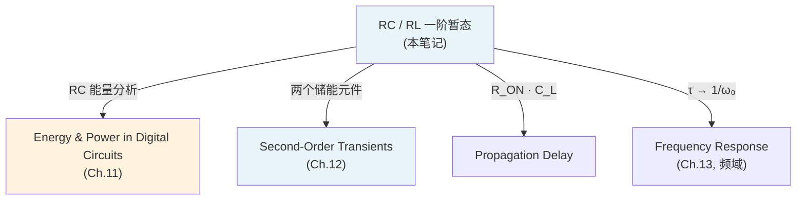

---
tags:
  - 电路学
  - 动态电路
  - 暂态分析
  - 课程笔记
date: 2026-09-08
aliases:
  - 一阶暂态
  - 一阶暂态电路
  - First-Order Transients
  - First-Order Circuit
  - RC Circuit
  - RL Circuit
  - 一阶电路
  - Time Constant
  - 时间常数
  - 状态变量
  - State Variables
  - 传播延迟
  - Propagation Delay
  - 直觉分析
  - Intuitive Analysis
---

# First-Order Transients（一阶暂态电路）

> [!NOTE] 本笔记定位
> 对应教材 **Ch.10 *First-Order Transients***。承上：[[Capacitor|电容]] / [[Inductor|电感]] 的本构关系给出"有记忆"元件——$v_C$ 不能突变、$i_L$ 不能突变；承下：这些储能元件与电阻组合后，电路从一种稳态过渡到另一种稳态的过程即为**暂态 (transient)**。本笔记覆盖 RC / RL 电路的阶跃响应、零输入响应、方波稳态、**状态变量 (state variables)** 概念、**传播延迟 (propagation delay)** 与**直觉分析 (intuitive analysis)** 方法。
> 与 [[Energy and Power in Digital Circuits|数字电路能量与功率]] 和 [[Second-Order Transients|二阶暂态电路]] 紧密衔接。
> 与 [[cs6.002x.1|知识树]] 互链。

---

## 一、什么是暂态 (Transient)？

> [!IMPORTANT] 核心概念
> 含储能元件（[[Capacitor|电容]] / [[Inductor|电感]]）的电路在**换路 (switching)** 瞬间，因储能元件的**状态变量不能突变**（$v_C(0^+)=v_C(0^-)$，$i_L(0^+)=i_L(0^-)$），电路不能瞬时跳到新稳态，而是经历一段**指数渐近过渡**——这段过渡过程就是**暂态 (transient response)**。

- **稳态 (steady state)**：$t\to\infty$ 后电路达到的稳定状态（直流稳态下电容开路、电感短路）。
- **暂态 (transient)**：从初始状态到稳态之间的过渡。
- **一阶 (first-order)**：电路只含**一个**独立储能元件（或可化简为一个等效 C 或 L），其行为由**一阶常微分方程**描述。


---

## 二、状态变量 (State Variables)

> [!IMPORTANT] 状态变量是"记忆"
> 电容的 $v_C$ 与电感的 $i_L$ 是电路的**状态变量 (state variables)**——它们编码了储能元件的全部历史。给定 $t_0$ 时刻的状态变量值与 $t\ge t_0$ 的输入，就能唯一确定电路在此后的全部行为。

| 储能元件 | 状态变量 | 连续性 | 本构关系 |
| :--- | :--- | :--- | :--- |
| 电容 Capacitor | $v_C$ | $v_C(0^+)=v_C(0^-)$ | $i = C\,\dfrac{dv}{dt}$ |
| 电感 Inductor | $i_L$ | $i_L(0^+)=i_L(0^-)$ | $v = L\,\dfrac{di}{dt}$ |

> [!TIP] 换路定则 (Switching Theorem)
> 换路瞬间（$t=0$），**状态变量不变**——这就是求解一阶暂态初始条件的核心法则。物理上，能量不能突变（$E_C=\frac{1}{2}Cv^2$、$E_L=\frac{1}{2}Li^2$ 是连续函数），否则功率趋于无穷大。

### 2.1 为什么是"一阶"？

对含一个电容的电路，把电容以外的部分用 [[Thevenin's Theorem|戴维南等效]] 化简为 $V_{Th}$ 串联 $R_{Th}$，则：

$$R_{Th}\,C\,\frac{dv_C}{dt} + v_C = V_{Th}$$

这是一阶线性常系数 ODE，通解为指数形式。对含一个电感的电路同理：

$$\frac{L}{R_{Th}}\,\frac{di_L}{dt} + i_L = I_{Th}$$

> [!NOTE] 状态变量法的核心思想
> 选状态变量 $x$（$v_C$ 或 $i_L$），写出一阶 ODE $\dot{x} = f(x, t)$，再解。这种方法自然推广到二阶（两个状态变量），见 [[Second-Order Transients]]。

---

## 三、RC 电路暂态 (RC Transients)

### 3.1 零输入响应 (Natural / Source-Free Response)

电容已充电至 $V_0$，$t=0$ 时开关闭合让电容通过电阻 $R$ 放电：

$$R\,C\,\frac{dv_C}{dt} + v_C = 0 \qquad\Longrightarrow\qquad \boxed{v_C(t) = V_0\, e^{-t/\tau}, \quad \tau = RC}$$

- $v_C$ 从 $V_0$ 指数衰减到 0。
- 放电电流 $i(t) = \dfrac{V_0}{R}\,e^{-t/\tau}$。
- 电容储能 $E_C(t) = \frac{1}{2}CV_0^2\,e^{-2t/\tau}$，全部被电阻消耗殆尽。

### 3.2 阶跃响应 (Step Response)

$V_S$ 通过 $R$ 给零初始电容充电（$v_C(0)=0$）：

$$RC\,\frac{dv_C}{dt} + v_C = V_S \qquad\Longrightarrow\qquad \boxed{v_C(t) = V_S\left(1 - e^{-t/\tau}\right), \quad \tau = RC}$$

- $v_C$ 从 0 指数上升趋向 $V_S$（新稳态）。
- 充电电流 $i(t) = \dfrac{V_S}{R}\,e^{-t/\tau}$，$t=0$ 时最大（电容"看起来像短路"），之后衰减。

![[rc_first_order.svg|500]]

> [!TIP] 时间常数 $\tau = RC$ 的工程直觉
> - $t = \tau$：到达终值的 $63.2\%$（充电）或衰减到 $36.8\%$（放电）。
> - $t = 5\tau$：到达终值的 $99.3\%$，工程上认为**暂态结束**。
> - $\tau$ 越大 → 变化越慢（大电容 / 大电阻 = "惯性大"）；$\tau$ 越小 → 响应越快。
> - $RC$ 量纲验证：$\Omega \times \text{F} = \text{s}$（秒）。

### 3.3 全响应 = 零输入 + 零状态 (Superposition)

如果电容既有初始电压 $V_0$ 又有外加阶跃 $V_S$，则由叠加原理：

$$v_C(t) = \underbrace{V_0\, e^{-t/\tau}}_{\text{零输入响应}} + \underbrace{V_S(1 - e^{-t/\tau})}_{\text{零状态响应}} = V_S + (V_0 - V_S)\,e^{-t/\tau}$$

> [!NOTE] 通解形式：终值 + 指数项
> 任何一阶电路的全响应都可以写成：
> $$x(t) = x(\infty) + \big[x(0) - x(\infty)\big]\, e^{-t/\tau}$$
> 其中 $x(0)$ 为初始值（换路定则给出），$x(\infty)$ 为终值（稳态分析给出），$\tau$ 为时间常数。这就是**直觉分析 (intuitive analysis)** 的基础。

---

## 四、RL 电路暂态 (RL Transients)

RL 电路与 RC 电路**完全对偶**：把 $v_C \leftrightarrow i_L$，$C \leftrightarrow L$，$R$ 不变，$V \leftrightarrow I$：

| 性质 | RC | RL |
| :--- | :--- | :--- |
| 状态变量 | $v_C$ | $i_L$ |
| 时间常数 | $\tau = RC$ | $\tau = L/R$ |
| 零输入衰减 | $v_C = V_0\,e^{-t/\tau}$ | $i_L = I_0\,e^{-t/\tau}$ |
| 阶跃上升 | $v_C = V_S(1-e^{-t/\tau})$ | $i_L = \dfrac{V_S}{R}(1-e^{-t/\tau})$ |
| 直流稳态 | 电容**开路** | 电感**短路** |
| $t=0$ 瞬态 | 电容"像短路"（$v$ 不变但 $i$ 跳变） | 电感"像开路"（$i$ 不变但 $v$ 跳变） |

![[rl_first_order.svg|500]]

> [!TIP] 对偶记忆法
> 电阻 $R$ 与电容 $C$ "乘"出 RC 时间常数；电阻 $R$ 与电感 $L$ "除"出 RL 时间常数。电阻在两种电路里角色相反：RC 中 $R$ 越大越慢（限流充电），RL 中 $R$ 越大越快（加速消磁）。

---

## 五、方波响应 (Square-Wave Response)

当 RC 电路的输入为周期方波时，稳态响应呈现**充放电交替**的锯齿状波形：

![[rc_square_wave.svg|500]]

> [!IMPORTANT] 方波响应的两个关键条件
> - **$\tau \ll T$（快充快放）**：输出接近方波（电容跟踪输入），用于**耦合 / 高通**。
> - **$\tau \gg T$（慢充慢放）**：输出接近输入的**积分**（三角波），用于**积分器**。
> - 稳态下，电容电压在 $V_{min}$ 与 $V_{max}$ 之间摆动，稳态平均值等于输入直流分量（电荷平衡）。

> [!NOTE] "稳态"不等于"直流"
> 方波激励下的稳态是**周期稳态 (periodic steady state)**——每个周期的波形重复，但电容电压不再是常数，而是周期变化的。

---

## 六、直觉分析方法 (Intuitive Analysis)

不用解微分方程，只需确定**三个量**即可写出一阶电路全响应：

> [!IMPORTANT] 三步法
> $$x(t) = x(\infty) + [x(0^+) - x(\infty)]\,e^{-t/\tau}$$
> 1. **初始值 $x(0^+)$**：用换路定则（$v_C$ 或 $i_L$ 不变）+ 换路后瞬间的 KCL/KVL 求出。
> 2. **终值 $x(\infty)$**：直流稳态分析——电容**开路**、电感**短路**，用纯电阻电路求解。
> 3. **时间常数 $\tau$**：从储能元件看进去，把其余独立源置零，求等效电阻 $R_{eq}$，则 $\tau = R_{eq}C$ 或 $\tau = L/R_{eq}$。

### 6.1 求 $R_{eq}$ 的方法

- 独立源置零（电压源**短路**、电流源**开路**）。
- 受控源**保留**。
- 从储能元件端口看入，用串并联化简或 [[Thevenin's Theorem|戴维南]] / [[Norton's Theorem|诺顿]] 方法求等效电阻。

> [!WARNING] 含受控源时 $\tau$ 不能简单套用
> 电路含受控源时，$R_{eq}$ 不是简单的串并联——需用"加压求流法"（在储能元件端口加测试电压 $V_{test}$，求 $I_{test}$，$R_{eq} = V_{test}/I_{test}$）。

### 6.2 直觉分析的优势

> [!TIP] 为什么直觉分析重要？
> 工程师面对一阶电路时，几乎不需要解 ODE——三步法可以直接给出表达式。更重要的是，它培养了对 $\tau$ 的直觉：看到 $R = 1\,\text{k}\Omega$、$C = 1\,\mu\text{F}$ 就知道 $\tau = 1\,\text{ms}$，看到 $R = 10\,\text{k}\Omega$、$C = 10\,\text{pF}$ 就知道 $\tau = 100\,\text{ns}$。

---

## 七、传播延迟与数字抽象 (Propagation Delay)

> [!IMPORTANT] 从模拟到数字的桥梁
> [[The MOSFET Switch|MOSFET 开关]] 中用 **SR model**（导通电阻 $R_{ON}$）建立了数字门的静态模型。但真实门在翻转时，输出端的**负载电容 $C_L$**（下级输入电容 + 寄生电容）需要通过 $R_{ON}$ 充放电——这正是**一阶 RC 暂态**！

### 7.1 $R_{ON}C_L$ 延迟模型

$$\tau_{gate} = R_{ON}\,C_L$$

- 输出从 0 翻到 $V_{DD}$（或反向）：$v_{out}(t) = V_{DD}(1 - e^{-t/\tau_{gate}})$
- 达到 50% 点（逻辑翻转阈值）的时间：
$$t_{pd} \approx 0.69\, R_{ON}\, C_L$$

> [!NOTE] 传播延迟 (Propagation Delay) 的定义
> 传播延迟 $t_{pd}$ 是从输入翻转到输出越过判定阈值的时间。它是数字电路**速度**的核心指标——时钟频率 $f_{clk}$ 受限于最慢路径的 $t_{pd}$ 总和。

### 7.2 与 [[Static Discipline|静态纪律]] 的关系

$$V_{out}(t_{pd}) = V_{IH} \quad\text{或}\quad V_{IL}$$

传播延迟就是 RC 响应到达 [[Static Discipline|静态纪律]] 阈值的时间——如果 $R_{ON}C_L$ 太大，翻转来不及在时钟周期内完成，电路出错。

```mermaid
graph TD
    A["MOSFET SR Model<br/>R_ON"] -->|"| B["Load Capacitor C_L"]
    B -->|"\tau = R_ON \cdot C_L"| C["RC First-Order Transient"]
    C -->|"t_pd \approx 0.69 \tau"| D["Propagation Delay<br/>Digital Speed Limit"]
    style C fill:#fff3e0
```

> [!TIP] 优化方向
> 1. 减小 $R_{ON}$：增大 $W/L$（更大晶体管 → 更强驱动）。
> 2. 减小 $C_L$：更小器件、更短走线、更少扇出。
> 3. 这就是为什么先进工艺（更小节点）速度更快——$C_{ox}$ 随 $t_{ox}$ 减小而减小，$C_L$ 整体下降。

---

## 八、典型例题

> [!EXAMPLE] RC 充电
> $V_S = 5\,\text{V}$，$R = 1\,\text{k}\Omega$，$C = 1\,\mu\text{F}$，$v_C(0) = 0$，$t=0$ 闭合开关。求 $v_C(1\,\text{ms})$ 与 $i(1\,\text{ms})$。
>
> $\tau = RC = 1\,\text{k}\Omega \times 1\,\mu\text{F} = 1\,\text{ms}$
> $$v_C(1\,\text{ms}) = 5(1 - e^{-1}) = 5 \times 0.632 = 3.16\,\text{V}$$
> $$i(1\,\text{ms}) = \frac{5}{1000}\,e^{-1} = 1.84\,\text{mA}$$

> [!EXAMPLE] RL 去激励
> $I_0 = 2\,\text{A}$，$R = 10\,\Omega$，$L = 50\,\text{mH}$，求 $i_L(5\,\text{ms})$。
>
> $\tau = L/R = 50\,\text{mH}/10\,\Omega = 5\,\text{ms}$
> $$i_L(5\,\text{ms}) = 2\,e^{-1} = 0.736\,\text{A}$$
> 电阻两端电压 $v_R = i_L \times R = 7.36\,\text{V}$。

> [!EXAMPLE] 传播延迟估算
> $R_{ON} = 1\,\text{k}\Omega$，$C_L = 10\,\text{pF}$，$V_{DD} = 5\,\text{V}$，阈值 $V_{IH} = 3.5\,\text{V}$，求 $t_{pd}$。
>
> $\tau = R_{ON}C_L = 1\,\text{k}\Omega \times 10\,\text{pF} = 10\,\text{ns}$
> $$t_{pd} = -\tau\ln\!\left(1 - \frac{V_{IH}}{V_{DD}}\right) = -10\ln(1 - 0.7) = -10\ln(0.3) \approx 12\,\text{ns}$$

---

## 九、常见误区 (Pitfalls)

> [!WARNING] 初始条件陷阱
> 1. **忘记换路定则**：直接把 $v_C(0^+) = 0$ 或 $i_L(0^+) = 0$——只有储能元件**初始未储能**时才成立。换路前已储能的元件，$v_C(0^+)=v_C(0^-) \neq 0$。
> 2. **$t=0^+$ 时的等效电路画错**：$t=0^+$ 瞬间，电容用**电压源** $V_0$ 替代、电感用**电流源** $I_0$ 替代（不是开路/短路！）。
> 3. **终值分析忘记"电容开路、电感短路"**：直流稳态下，电容开路（$i=0$）、电感短路（$v=0$），不是反过来。

> [!TIP] $t=0^+$ 等效电路速查
> | 元件 | $t=0^-$ (换路前) | $t=0^+$ (换路后瞬间) | $t=\infty$ (稳态) |
> | :--- | :--- | :--- | :--- |
> | 电容 $C$ | 用换路前稳态分析 | **电压源** $v_C(0^+)=v_C(0^-)$ | **开路** ($i=0$) |
> | 电感 $L$ | 用换路前稳态分析 | **电流源** $i_L(0^+)=i_L(0^-)$ | **短路** ($v=0$) |

---

## 十、与后续笔记的衔接



> [!NOTE] 从时域到频域
> 一阶 RC 电路的时域响应 $v_C(t) = V_S(1 - e^{-t/\tau})$ 在频域对应一个**低通滤波器**（$|H(j\omega)| = 1/\sqrt{1+(\omega\tau)^2}$）。时域的 $\tau$ 与频域的截止频率 $\omega_c = 1/\tau$ 是同一物理量的两面——详见 [[Frequency Response]] 和 [[Impedance]]。

---

## 相关笔记

- [[Capacitor]] —— $i = C\,dv/dt$、电压连续、$E_C = \frac{1}{2}Cv^2$（状态变量来源）
- [[Inductor]] —— $v = L\,di/dt$、电流连续、$E_L = \frac{1}{2}Li^2$（对偶状态变量）
- [[Kirchhoff's Laws]] —— 列写暂态微分方程的基础
- [[Thevenin's Theorem]] / [[Norton's Theorem]] —— 化简电路求 $R_{eq}$ 与 $\tau$
- [[Superposition Theorem]] —— 全响应 = 零输入 + 零状态
- [[The MOSFET Switch]] —— $R_{ON}$、SR model、$C_L$ 负载
- [[Energy and Charge Conservation]] —— 换路定则的物理根源（能量不能突变）
- [[Energy and Power in Digital Circuits]] —— RC 充放电的能量损耗分析
- [[Second-Order Transients]] —— LC / RLC 二阶动态（两个状态变量）
- [[cs6.002x.1]] —— 电路原理知识树（主笔记）
