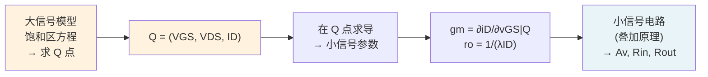

---
tags:
  - 电路学
  - 放大器
  - 大信号分析
  - 课程笔记
date: 2026-09-08
aliases:
  - Large-Signal Model
  - 大信号模型
  - 直流工作点
  - Q Point
  - Biasing
  - 直流偏置
  - 大信号
  - Large Signal
---

# Large-Signal Model（大规模信号模型）

> [!NOTE] 本笔记定位
> 放大器分析的**第一阶段**：器件在大电压/电流摆幅下的**完整非线性模型**——不是"线性化的小信号"，而是**分段定义的物理方程**（[[MOSFET]] 的 Cutoff / Triode / Saturation 三段）。目标是确定**直流工作点 (Q 点)**，为 [[Small Signal Circuit Representation|小信号分析]] 提供线性化的"基准"。
> 与 [[The MOSFET Amplifier]] 直接关联（放大器偏置）；与 [[Small Signal Circuit Representation]] 上下游衔接。
> 与 [[cs6.002x.1|知识树]] 互链。

---

## 一、大信号模型 vs 小信号模型

| 维度 | 大信号模型 (Large-Signal) | 小信号模型 (Small-Signal) |
| :--- | :--- | :--- |
| 信号摆幅 | 大（任意范围） | 小（在 Q 点附近线性化） |
| 数学形式 | 分段非线性方程 | 线性（$g_m v_{gs}$ 等效电路） |
| 分析目标 | 直流偏置 / 工作点 Q | 增益 / 输入输出阻抗 |
| 适用场景 | 设计偏置电路、确定线性范围 | 信号放大、频响分析 |
| 叠加原理 | ❌ 不适用 | ✅ 适用 |

> [!IMPORTANT] 理解两者的关系
> 大信号模型是**上游**——没有正确的 Q 点，小信号参数 ($g_m$、$r_o$) 就无从谈起；小信号模型是**下游**——在 Q 点附近的线性近似，使电路可分析。两者缺一不可。

---

## 二、MOSFET 大信号模型（三区）

### 2.1 分段本构方程

$$I_D = \begin{cases} \text{Cutoff（截止）:} & 0, & v_{GS} < V_t \\[4pt] \text{Triode（线性/三极管）:} & K\bigl[2(v_{GS}-V_t)v_{DS} - v_{DS}^2\bigr], & v_{DS} < v_{GS} - V_t \\[6pt] \text{Saturation（饱和）:} & \dfrac{K}{2}(v_{GS} - V_t)^2(1+\lambda v_{DS}), & v_{DS} > v_{GS} - V_t \end{cases}$$

| 工作区 | 条件 | 物理含义 | 典型应用 |
| :--- | :--- | :--- | :--- |
| **Cutoff** | $v_{GS} < V_t$ | 沟道未形成，无电流 | 数字 0 状态，开关 OFF |
| **Triode** | $v_{GS}>V_t,\; v_{DS}<v_{GS}-V_t$ | 沟道存在且未夹断，类似线性电阻 | 模拟电阻（$R_{ON}$ 近似）、数字 1 充电 |
| **Saturation** | $v_{GS}>V_t,\; v_{DS}>v_{GS}-V_t$ | 沟道夹断，电流与 $v_{DS}$ 几乎无关（恒流） | **放大器工作区** |

> [!TIP] 记忆法
> "截止=关"（无电流）、"三极管=变阻区"（电阻随 $v_{DS}$ 变化）、"饱和=恒流源"（电流稳定，不管 $v_{DS}$ 多大）。

### 2.2 沟道长度调制 (Channel-Length Modulation)

饱和区公式中的 $(1+\lambda v_{DS})$ 项：

- $\lambda$：**沟道长度调制系数**，与工艺相关（$\lambda\propto 1/L$）
- $\lambda v_{DS}$：当 $v_{DS}$ 增大时，有效沟道缩短，$I_D$ 略增
- 物理后果：饱和区电流并非真正恒定，而是有**有限输出阻抗** $r_o = 1/(\lambda I_D)$

这正是 [[Small Signal Circuit Representation|小信号模型]] 中 $r_o$ 的来源。

---

## 三、直流工作点 (Q Point) 的意义

### 3.1 什么是 Q 点？

Q 点（Quiescent Point）是**无输入信号时**（直流偏置），电路各节点的直流电压与支路直流电流的集合：
$$Q = (V_{GS}, V_{DS}, I_D)$$

> [!NOTE] Q 点决定了"放大器的性格"
> Q 点偏置的位置直接决定了：小信号参数 $g_m$、线性输入范围、失真、功耗、噪声——所有小信号性能都是 Q 点的函数。

### 3.2 Q 点偏置的三大约束

分析放大器直流偏置时，同时满足：

1. **器件方程**：$I_D$ 必须满足 MOSFET 大信号方程（饱和区）
2. **电路 KVL**：电源电压分配到各元件上
3. **电路 KCL**：各节点电流和为零

$$\boxed{\text{Q 点} = \text{器件方程} \cap \text{KVL} \cap \text{KCL}}$$

---

## 四、共源放大器的直流偏置分析

### 4.1 电路与 KVL

![[cs_amplifier_stage.svg]]

从 VDD 到地的 KVL：
$$V_{DD} = I_D R_D + V_{DS} + V_{SS}$$
通常 $V_{SS}=0$（地），即：
$$V_{DD} = I_D R_D + V_{DS}$$

加上 MOSFET 饱和区方程（忽略 $\lambda$ 简化分析）：
$$I_D = \frac{K}{2}(V_{GS} - V_t)^2$$

### 4.2 图解法：负载线 (Load Line)

把 $V_{DD}=I_D R_D+V_{DS}$ 改写为：
$$\boxed{I_D = -\frac{1}{R_D}V_{DS} + \frac{V_{DD}}{R_D}}$$

这是一条斜率为 $-1/R_D$ 的直线（**直流负载线**），与 MOSFET $I_D$–$V_{DS}$ 特性曲线的交点即为 Q 点。

> [!IMPORTANT] 图解法的价值
> 负载线把**电路约束**（KVL 的线性关系）和**器件约束**（MOSFET 的非线性 $I$–$V$ 曲线）放在同一张图上，直观显示：
> - Q 点位置（交点）
> - 输入信号摆幅的线性范围（Q 点两侧不进入截止/三极管区的范围）
> - 直流功耗 $P = V_{DD}\cdot I_D$

---

## 五、典型偏置电路

### 5.1 固定栅压偏置（最简单，不实用）

$$V_{GS}=V_{GG}=\text{固定直流}, \quad I_D=\frac{K}{2}(V_{GG}-V_t)^2$$

> [!WARNING] 问题：工艺偏差 (process variation)
> $V_t$、$K$ 在芯片上随位置变化可达 ±20%，固定 $V_{GS}$ 会导致 $I_D$ 变化 40%+——这个放大器无法实用。

### 5.2 电流源偏置（工程实用）

用[[Current Sources and Mirrors|电流镜]]提供恒定 $I_{REF}$，镜像到放大管：
$$I_D = I_{REF} = \frac{K}{2}(V_{GS}-V_t)^2 \quad\Longrightarrow\quad I_D \text{ 与 } V_t\text{、}K\text{ 无关（相对稳定）}$$

> [!TIP] 电流镜偏置是模拟 IC 的"灵魂"
> 几乎所有实用放大器都用电流镜偏置——它把 $I_D$ 与绝对工艺参数解耦，只依赖于**电流镜管的相对比例**（版图匹配好时精度高）。

### 5.3 分压偏置（source degeneration）

$$V_{GS} = V_{DD}\frac{R_2}{R_1+R_2},\quad I_D = \frac{V_{DD}-V_{GS}}{R_S}$$

加入 $R_S$ 源极负反馈后，$I_D$ 对 $V_t$ 变化的敏感性降低（负反馈原理）。

---

## 六、Q 点与小信号参数的关系

| Q 点参数 | 物理量 | 对小信号参数的影响 |
| :--- | :--- | :--- |
| $I_D$ | 漏极直流电流 | $g_m = \sqrt{2KI_D}$（$I_D$ 大则 $g_m$ 大） |
| $V_{GS}-V_t$ | 过驱电压 | $g_m = 2K(V_{GS}-V_t)$ |
| $V_{DS}$ | 漏源直流电压 | 决定是否在饱和区、$r_o$ 大小 |
| $R_D$ | 负载电阻 | $A_v = -g_m(R_D\|r_o)$，$V_{DS}=V_{DD}-I_DR_D$ |

> [!NOTE] 增益–功耗折中
> $g_m = \sqrt{2KI_D}$ 表明：增大 $I_D$ 可以提高增益，但功耗 $P=V_{DD}I_D$ 也随之增加。设计者必须在**增益**、**带宽**、**功耗**三者之间做折中。

---

## 七、承前启后：从大信号到小信号

> [!NOTE] 大信号失真 (Large-Signal Distortion)
> 当输入信号摆幅使 $v_{GS}$ 离开 Q 点附近的线性范围（例如进入 triode 区或 cutoff 区），MOSFET 不再满足饱和区平方律，输出信号**失真**。这是大信号模型分析"线性范围"的实际意义。

---

## 相关笔记

- [[MOSFET]] —— 器件物理与饱和区/三极管/截止区的物理含义
- [[Small Signal Circuit Representation]] —— 在 Q 点线性化后的完整小信号参数
- [[The MOSFET Amplifier]] —— 共源放大器的直流偏置与交流小信号联合分析
- [[Current Sources and Mirrors]] —— 电流镜偏置（工程实用的偏置方案）
- [[Analysis of Nonlinear Circuits]] —— 非线性电路的图解法（负载线）详解
- [[First-Order Transients]] —— 偏置建立时间（直流工作点的瞬态建立）
- [[cs6.002x.1]] —— 电路原理知识树（主笔记）
