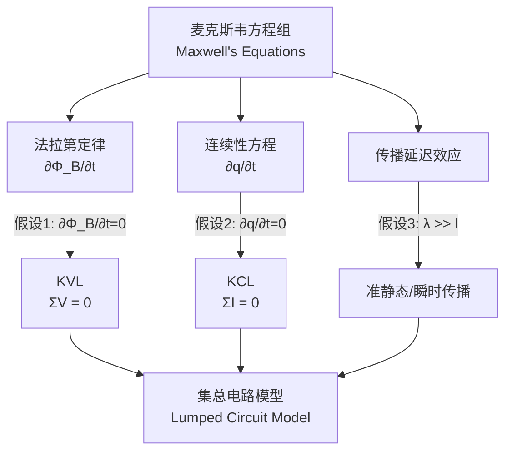

---
tags:
  - 电路学
  - 电磁学
  - 课程笔记
date: 2026-08-15
aliases:
  - 集总事物理论
  - 集总参数理论
  - 集总电路模型
  - 集总模型
  - 集总元件假设
  - LMD
  - Lumped Matter Discipline
---

# 集总事物理论 (Lumped Matter Discipline, LMD)

> [!IMPORTANT] 什么是 LMD？
> 集总事物理论（LMD）是一组**工程约束/假设**，它让我们能够把由 [[Maxwell's Equations|麦克斯韦方程组]] 描述的复杂电磁场问题，**简化**为只用几个"集总元件 (Lumped Elements)"和几条连线就能描述的**电路模型**。
> LMD 成立后，KCL 与 KVL 才成为**严格成立**的定律，而非近似经验。

---

## 一、为什么需要 LMD？

麦克斯韦方程组是**偏微分方程**，描述空间每一点的场。但实际电路中有导线、电阻、电容、电感……如果每条连线都要用场论求解，复杂度不可接受。

LMD 的思路是：**把电磁效应"锁"进元件内部**，让元件之间的连线变成"理想导线"——没有寄生磁场、没有电荷积累，只有"理想的电压与电流"。这样电路就能用**代数方程**（KCL/KVL）而非偏微分方程来描述。

---

## 二、三条核心假设

LMD 要求，在**元件外部（Outside elements）** 必须同时满足以下三条：

### 假设 1：磁场约束 —— 磁通量变化率为 0

$$\frac{\partial \Phi_B}{\partial t} = 0$$

- **含义**：任何回路所包围的、在元件外部的磁通量，不随时间变化。
- **来源**：法拉第定律 $\oint \mathbf{E} \cdot d\mathbf{l} = -\dfrac{\partial \Phi_B}{\partial t}$。
- **推论**：若 $\dfrac{\partial \Phi_B}{\partial t} = 0$，则任意回路 $\oint \mathbf{E} \cdot d\mathbf{l} = 0$，即**沿闭合回路电压代数和为 0** —— 这就是 **KVL**。

### 假设 2：电荷约束 —— 电荷量变化率为 0

$$\frac{\partial q}{\partial t} = 0$$

- **含义**：任何节点处，元件外部积累的净电荷不随时间变化。
- **来源**：电荷连续性方程 $\oint \mathbf{J} \cdot d\mathbf{S} = -\dfrac{\partial q}{\partial t}$。
- **推论**：若 $\dfrac{\partial q}{\partial t} = 0$，则流入某节点的净电流为 0，即**节点处电流代数和为 0** —— 这就是 **KCL**。

### 假设 3：时间尺度约束 —— 信号传播可视为瞬时

> [!NOTE] 准静态假设 (Quasi-static Assumption)
> 电路尺寸必须**远小于**信号的电磁波长，即信号的周期远大于电磁波跨越电路所需的传播时间：
> $$\lambda \gg l \quad\Longleftrightarrow\quad \tau_{signal} \gg \tau_{propagation}$$

- **含义**：在感兴趣的时间尺度上，信号可以认为**瞬时到达**电路的每个角落，不需要考虑"传播延迟"。
- **来源**：麦克斯韦方程中 $\dfrac{\partial \mathbf{E}}{\partial t}$、$\dfrac{\partial \mathbf{B}}{\partial t}$ 的空间传播效应。
- **推论**：电路可以被视为**空间上"零尺寸"的点集**——这正是"集总 (Lumped)"一词的由来：元件的空间分布被忽略了。

---

## 三、LMD → KCL / KVL 的推导脉络

---

## 四、什么时候 LMD 会失效？

> [!WARNING] LMD 失效的场景
> 当三条假设**任一**被破坏时，集总电路模型就不再成立，必须回到麦克斯韦方程或"分布参数电路"（如传输线理论）。

| 失效情形 | 破坏的假设 | 典型例子 |
| :--- | :--- | :--- |
| 信号频率极高，波长 $\lambda$ 接近或小于电路尺寸 $l$ | 假设 3 | 微波电路、天线、高速数字电路中的传输线效应 |
| 元件外部存在不可忽略的寄生电感/互感（磁通泄漏） | 假设 1 | 长导线上的杂散电感、变压器漏磁 |
| 节点处存在明显的电荷积累（寄生电容） | 假设 2 | 高频下的寄生电容、静电放电 |

> [!TIP] 工程直觉
> **LMD 是一把"有适用范围的尺子"。** 在低频、小尺寸电路（绝大多数模拟电路、单片机外围电路）中它严格成立；一旦进入高频/射频/高速数字领域，就要警惕它的边界，改用具传输线模型的分析方法。

---

## 五、与集总元件的配合

LMD 把电磁效应"关进"元件内部，于是我们可以定义三种理想集总元件，其外部严格满足 LMD：

| 元件 | 本构关系 (Constitutive Relation) | 内部"锁住"的电磁效应 |
| :--- | :--- | :--- |
| 电阻 Resistor | $V = IR$ | 电磁能 → 热能（耗散） |
| 电容 Capacitor | $i = C\dfrac{dv}{dt}$ | 电场能（电荷积累，在极板内部） |
| 电感 Inductor | $v = L\dfrac{di}{dt}$ | 磁场能（磁通变化，在线圈内部） |

> [!NOTE] 关键理解
> 注意：**电容内部的 $\dfrac{\partial q}{\partial t}$、电感内部的 $\dfrac{\partial \Phi_B}{\partial t}$ 都不为零**——LMD 只约束**元件外部**，这正是元件能够"工作"的原因。我们把所有"违反麦克斯韦方程简化"的复杂性，都打包进了元件的本构关系里。

---

## 相关笔记

- [[Maxwell's Equations]] —— LMD 的电磁学来源
