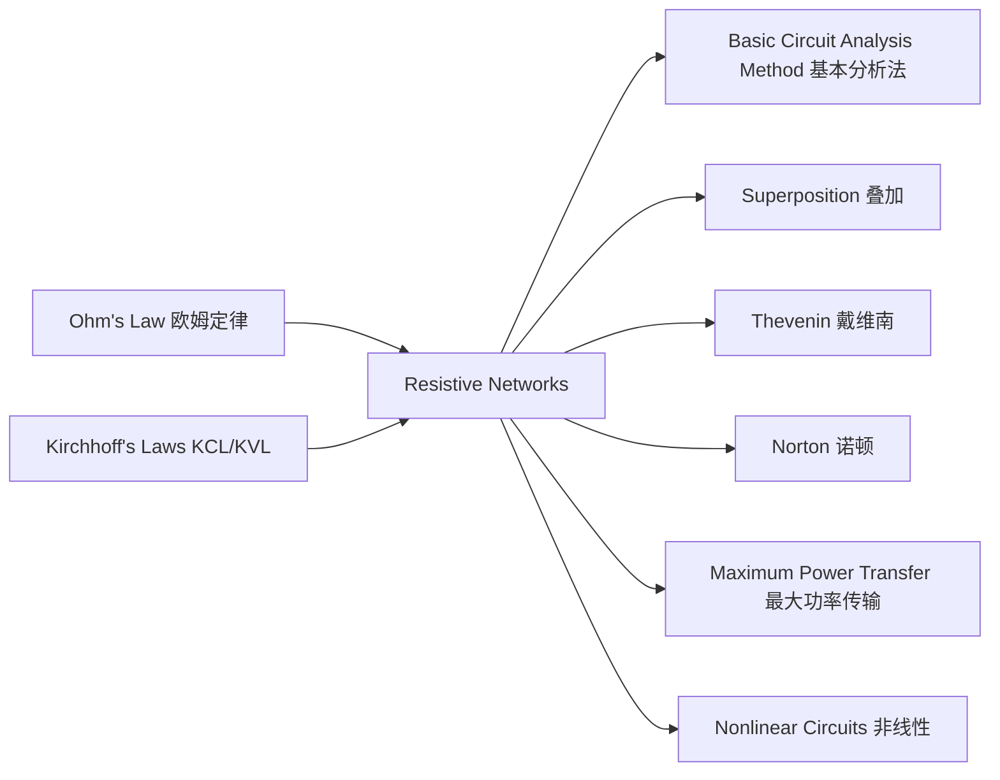

---
tags:
  - 电路学
  - 电路基础
  - 电路分析
date: 2026-09-06
aliases:
  - 电阻网络
  - 电阻电路
  - 电阻性网络
  - Resistive Networks
  - Resistive Circuit
  - 电阻网络分析
---

# Resistive Networks（电阻网络）

> [!NOTE] 本章定位
> **电阻网络 (Resistive Networks, Ch.2)** 研究只含电阻与独立源、所有元件均**线性**时的电路。它把 [[Ohm's Law|欧姆定律]]（元件层）与 [[Kirchhoff's Laws|基尔霍夫定律]]（拓扑层）组合起来，发展出**系统化求解方法**：
> - **拓扑术语**：节点 (Node) / 支路 (Branch) / 回路 (Loop) / 网孔 (Mesh) —— 描述"电路长什么样"；
> - **组合规则**：串联 / 并联化简、分压 / 分流 —— 直觉快速的化简；
> - **系统方法**：暴力法、节点法、网孔法（见 [[Basic Circuit Analysis Method|基本电路分析法]] 与 [[Kirchhoff's Laws|基尔霍夫定律]]）。

本章先建立拓扑语言，再讲组合化简与分压/分流——这是后续所有网络定理（[[Superposition Theorem|叠加]]、[[Thevenin's Theorem|戴维南]]、[[Norton's Theorem|诺顿]]、[[Maximum Power Transfer Theorem|最大功率传输]]）的共同基础。

---

## 一、拓扑术语 (Circuit Topology)

![[resistive_topology.svg|380]]

| 术语 | 英文 | 定义 |
| :--- | :--- | :--- |
| **节点** | Node | 两个及以上支路的连接点（图中 n₁, n₂, n₃ 实心圆点） |
| **支路** | Branch | 两个节点之间的一段电路（含一个元件与可能的源） |
| **回路** | Loop | 从某节点出发、沿支路走回原点的任意闭合路径 |
| **网孔** | Mesh | **内部不含其他回路**的回路（平面电路中"最小"的回路，图中 Loop 3） |

> [!IMPORTANT] 独立方程数（与 [[Kirchhoff's Laws|基尔霍夫定律]]呼应）
> 设电路有 $n$ 个节点、$b$ 条支路：
> - 独立 **KCL 方程数** = $n-1$
> - 独立 **KVL 方程数** = $b - (n-1)$ = **网孔数**（对平面电路）
> - 合计 = $b$，正好解出 $b$ 个支路未知量。

---

## 二、串联 (Series) 与并联 (Parallel)

### 2.1 串联 — 同一电流流过，电压相加

![[series_parallel_series.svg|380]]

- **等效电阻**：$R_{eq} = R_1 + R_2 + \cdots + R_k$
- 物理直觉：电阻"排队"，阻碍累加，总阻值变大。
- 电流相同：$i_1 = i_2 = \cdots = i$ → 适用 **分压**。

### 2.2 并联 — 同一电压加在两端，电流相加

- **等效电导**：$G_{eq} = G_1 + G_2 + \cdots + G_k$，即 $\displaystyle \frac{1}{R_{eq}} = \frac{1}{R_1} + \frac{1}{R_2} + \cdots$
- 两电阻并联特例：$R_{eq} = \dfrac{R_1 R_2}{R_1 + R_2}$
- 电压相同：$v_1 = v_2 = \cdots = v$ → 适用 **分流**。

> [!NOTE] 图例
> 上方 `series_parallel_series.svg` 演示串联化简；下方 `series_parallel_parallel.svg` 演示三电阻并联等效。
> （注：`series_parallel.svg` / `voltage_current_divider.svg` 为早期合并图，存在支路重叠布局问题，已弃用，请勿引用。）

![[series_parallel_parallel.svg|380]]

> [!TIP] 串并联的本质是"电流/电压相同"
> 串联 ⇔ 各元件**电流相同**（分压）；并联 ⇔ 各元件**电压相同**（分流）。判断串并联，先看"谁和谁共享同一个电流或同一个电压"。

---

## 三、分压器 (Voltage Divider) 与分流器 (Current Divider)

![[voltage_divider.svg|380]]

### 3.1 分压公式（串联）

总电压 $V_{in}$ 跨在串联电阻 $R_1, R_2$ 上，抽头电压（取 $R_2$ 两端）：

$$V_{out} = V_{in}\,\frac{R_2}{R_1 + R_2}$$

> 推导：串联电流 $i = \dfrac{V_{in}}{R_1+R_2}$，故 $V_{out} = iR_2$。详见 [[Ohm's Law|欧姆定律 §三]]。

### 3.2 分流公式（并联）

总电流 $I$ 分给并联的 $R_1, R_2$，流过 $R_1$ 的电流：

$$I_1 = I\,\frac{R_2}{R_1 + R_2} = I\,\frac{G_1}{G_1 + G_2}$$

> 并联时各支路电压相同，电流按**电导**分配（电导大者分得多）。与分压公式对称。

![[current_divider.svg|380]]

---

## 四、等效电阻 (Equivalent Resistance) 与直觉法 (Intuitive Method)

> [!NOTE] 化简思路
> 复杂网络 → 反复用"串联相加 / 并联取倒数和" → 不断缩小 → 得到端口**等效电阻** $R_{eq}$。配合 [[Thevenin's Theorem|戴维南定理]]，可把任意线性网络看成一个等效电源 + 一个等效电阻。

**Agarwal 的"直觉法 (Intuitive Method)"** 要点：
1. **能量视角**：先估算总功耗 $P = V_{total}^2 / R_{eq}$，反推 $R_{eq}$；
2. **逐级化简**：从离端口最远的串/并联开始往回缩；
3. **对称性与等电位**：利用对称性（如电桥平衡时中点等电位可断开/短接）减少计算。

> [!TIP] 桥式电路的特殊性
> 一般**桥式 (bridge)** 网络（如 [[Basic Circuit Analysis Method|基本电路分析法]] 中的 Demo 电路）既非纯串联也非纯并联，不能直接套串并联公式，必须用节点法或网孔法求解——这正是"组合规则有边界、系统方法兜底"的典型例子。

---

## 五、与相关知识点的联系

- **元件层**：[[Ohm's Law|欧姆定律]] 给出每个电阻的 $v=iR$；
- **拓扑层**：[[Kirchhoff's Laws|基尔霍夫定律]] 给出元件间的连接约束；
- **方法层**：本章的组合规则 + [[Basic Circuit Analysis Method|基本分析法]] 把二者联立求解；
- **进阶**：网络定理（[[Superposition Theorem|叠加]]、[[Thevenin's Theorem|戴维南]]、[[Norton's Theorem|诺顿]]）与 [[Maximum Power Transfer Theorem|最大功率传输]] 都建立在"线性电阻网络"这一前提上；一旦元件非线性（[[Analysis of Nonlinear Circuits|非线性电路分析]]），这些线性工具需改造后才能用。

---

## 相关笔记

- [[Ohm's Law]] —— 元件层基石：$v=iR$
- [[Kirchhoff's Laws]] —— 拓扑层约束：KCL/KVL
- [[Basic Circuit Analysis Method]] —— 系统求解法（暴力法 / 节点法 / 网孔法）
- [[Thevenin's Theorem]] / [[Norton's Theorem]] —— 端口等效，依赖等效电阻
- [[Superposition Theorem]] —— 线性网络的叠加性质
- [[Maximum Power Transfer Theorem]] —— 电阻网络上的功率优化
- [[Analysis of Nonlinear Circuits]] —— 当电阻不再"线性"
- [[Wheatstone Bridge and Wye-Delta Transformation]] —— 惠斯通电桥与 Y-Δ 变换：串并联失效的桥式网络如何化简
- [[cs6.002x.1]] —— 电路原理知识树（主笔记）
