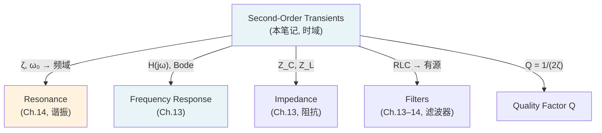

---
tags:
  - 电路学
  - 动态电路
  - 暂态分析
  - 课程笔记
date: 2026-09-08
aliases:
  - 二阶暂态
  - 二阶暂态电路
  - Second-Order Transients
  - Second-Order Circuit
  - RLC Circuit
  - LC Oscillation
  - Damping Ratio
  - 阻尼比
  - Overdamped
  - 过阻尼
  - Underdamped
  - 欠阻尼
  - Critically Damped
  - 临界阻尼
  - Natural Frequency
  - 自然频率
  - 状态变量法
  - State Variable Method
---

# Second-Order Transients（二阶暂态电路）

> [!NOTE] 本笔记定位
> 对应教材 **Ch.12 *Second-Order Circuits***。当电路同时包含电容与电感（两个独立储能元件），暂态由**二阶 ODE** 描述，行为远比一阶丰富：从单调衰减到振荡、从过阻尼到欠阻尼，展现出**阻尼 (damping)** 与**振荡 (oscillation)** 的完整光谱。本笔记覆盖 LC 无阻尼振荡、串联/并联 RLC 三种阻尼区、**阻尼比 $\zeta$** 与**自然频率 $\omega_0$**、**状态变量法**，以及双电容/双电感电路。
> 与 [[First-Order Transients|一阶暂态]] 和 [[Energy and Charge Conservation|能量守恒]] 紧密衔接，是通往 [[Resonance|谐振]] 与 [[Frequency Response|频率响应]] 的桥梁。
> 与 [[cs6.002x.1|知识树]] 互链。

---

## 一、从一阶到二阶：两个状态变量

> [!IMPORTANT] 二阶的本质
> [[First-Order Transients|一阶电路]] 只有一个状态变量（$v_C$ 或 $i_L$），行为由一阶 ODE 决定——解永远是单调指数。二阶电路有**两个**独立状态变量（$v_C$ 和 $i_L$），行为由二阶 ODE 决定——解可以是**两个指数的叠加**，也可以是**衰减振荡**。

| 维度 | 一阶 (First-Order) | 二阶 (Second-Order) |
| :--- | :--- | :--- |
| 储能元件数 | 1 个 C 或 L | 2 个（C + L，或 2C/2L） |
| 状态变量 | $v_C$ 或 $i_L$ | 两个独立储能（$v_C$ 和 $i_L$，或两个 $v_C$ / 两个 $i_L$） |
| ODE 阶数 | 1 | 2 |
| 特征方程 | 一次（1 个实根） | 二次（2 个根，可实/可复） |
| 响应形态 | 单调指数 | 衰减/振荡/临界 |
| 特征参数 | $\tau = RC$ 或 $L/R$ | $\omega_0 = 1/\sqrt{LC}$, $\zeta$ |

---

## 二、LC 无阻尼振荡 (Undamped Oscillation)

### 2.1 电路与方程

理想 LC 回路（$R = 0$），电容初始电压 $V_0$，电感初始电流为零。由 KVL：

$$v_L + v_C = 0 \quad\Longrightarrow\quad L\frac{di_L}{dt} + v_C = 0$$

结合 $i_L = C\,\frac{dv_C}{dt}$（电感电流流入电容正极板的参考方向），得：

$$\boxed{\frac{d^2v_C}{dt^2} + \omega_0^2\, v_C = 0, \qquad \omega_0 = \frac{1}{\sqrt{LC}}}$$

### 2.2 解：等幅正弦振荡

$$v_C(t) = V_0\cos(\omega_0 t), \qquad i_L(t) = -\frac{V_0}{Z_0}\sin(\omega_0 t)$$

其中 $Z_0 = \sqrt{L/C}$ 为**特征阻抗 (characteristic impedance)**。

![[lc_undamped.svg|500]]

> [!IMPORTANT] 能量在电场与磁场间"来回倒手"
> - $t=0$：全部能量在电容（$E_C = \frac{1}{2}CV_0^2$，$E_L=0$）。
> - $t = T_0/4$（$\omega_0 t = \pi/2$）：全部能量在电感（$E_C=0$，$E_L = \frac{1}{2}LI_{max}^2$）。
> - 总能量 $E_{\text{tot}} = \frac{1}{2}Cv_C^2 + \frac{1}{2}Li_L^2 = \frac{1}{2}CV_0^2 = \text{const}$——**守恒**！
>
> 这正是 [[Energy and Charge Conservation|能量守恒]] 中描述的 LC 振荡：能量在电场（电容）和磁场（电感）之间周期交换，永不衰减。

> [!TIP] $\omega_0$ 的物理直觉
> $\omega_0 = 1/\sqrt{LC}$ 告诉我们：$L$ 或 $C$ 越大，振荡越慢——更大的"惯性"（电感的磁场惯性 + 电容的电场惯性）。这与机械振子 $\omega = \sqrt{k/m}$ 完全对偶：$C \leftrightarrow 1/k$（弹簧柔度），$L \leftrightarrow m$（质量）。

---

## 三、串联 RLC 暂态 (Series RLC)

### 3.1 方程推导

串联 RLC 电路（$R$ 串联 $L$ 串联 $C$），由 KVL：

$$L\frac{di}{dt} + Ri + v_C = V_S$$

代入 $i = C\,dv_C/dt$：

$$\boxed{LC\frac{d^2v_C}{dt^2} + RC\frac{dv_C}{dt} + v_C = V_S}$$

齐次方程（$V_S = 0$，零输入响应）的特征方程：

$$s^2 + \frac{R}{L}s + \frac{1}{LC} = 0$$

### 3.2 两个关键参数

$$\omega_0 = \frac{1}{\sqrt{LC}} \qquad\text{(natural frequency, 自然频率)}$$

$$\zeta = \frac{R}{2}\sqrt{\frac{C}{L}} = \frac{R}{2\omega_0 L} \qquad\text{(damping ratio, 阻尼比)}$$

特征方程的根：

$$s_{1,2} = -\zeta\omega_0 \pm \omega_0\sqrt{\zeta^2 - 1}$$

### 3.3 三种阻尼区

| 阻尼区 | 条件 | 特征根 | 响应形态 |
| :--- | :--- | :--- | :--- |
| **过阻尼 (Overdamped)** | $\zeta > 1$ | 两个不同负实根 | 单调衰减（无振荡） |
| **临界阻尼 (Critically Damped)** | $\zeta = 1$ | 重根 $s = -\omega_0$ | 单调衰减（最快无振荡） |
| **欠阻尼 (Underdamped)** | $\zeta < 1$ | 共轭复根 $-\zeta\omega_0 \pm j\omega_d$ | 衰减振荡 |

其中**阻尼自然频率** (damped natural frequency)：

$$\omega_d = \omega_0\sqrt{1 - \zeta^2}$$

![[rlc_damping.svg|500]]

> [!IMPORTANT] 三种区间的物理解释
> - **过阻尼**：$R$ 太大 → 能量被电阻快速消耗，来不及振荡就衰减完。响应是两个不同时间常数的指数叠加。
> - **临界阻尼**：$R$ "刚好" → 能量被消耗的速率恰好阻止振荡，但衰减最快。工程中常用此设计（如仪表阻尼）。
> - **欠阻尼**：$R$ 较小 → 能量消耗慢于 LC 交换周期 → 振荡若干周期后衰减。数字PLL、滤波器常用。

### 3.4 欠阻尼详解 (Underdamped)

$$v_C(t) = V_0\, e^{-\zeta\omega_0 t}\cos(\omega_d t + \phi)$$

- $e^{-\zeta\omega_0 t}$：**包络线 (envelope)**，衰减速率由 $\zeta\omega_0$ 决定。
- $\cos(\omega_d t)$：振荡，频率 $\omega_d < \omega_0$（阻尼使振荡变慢）。
- 当 $\zeta \to 0$ 时 $\omega_d \to \omega_0$，退化为 LC 无阻尼振荡。

> [!TIP] 对数衰减率 (Logarithmic Decrement)
> 相邻两个峰值之比取对数：$\delta = \ln\!\frac{v_n}{v_{n+1}} = \frac{2\pi\zeta}{\sqrt{1-\zeta^2}}$。实验中测 $\delta$ 可反推 $\zeta$。

### 3.5 过阻尼详解 (Overdamped)

$$v_C(t) = A_1\, e^{s_1 t} + A_2\, e^{s_2 t}$$

两个负实根 $s_1, s_2$，$v_C$ 是两条衰减指数的叠加——没有过冲、没有振荡，但衰减比临界阻尼**更慢**（因为"快"根被"慢"根拖住）。

### 3.6 临界阻尼详解 (Critically Damped)

$$v_C(t) = (A_1 + A_2 t)\, e^{-\omega_0 t}$$

重根 $s = -\omega_0$，响应是"线性 × 指数"——无振荡且衰减最快。这是**最理想的非振荡响应**，在测量仪器（检流计、地震仪）设计中追求此区。

---

## 四、并联 RLC 暂态 (Parallel RLC)

并联 RLC 是串联 RLC 的**对偶**：

| 串联 RLC | 并联 RLC |
| :--- | :--- |
| $R$ 与 $L$、$C$ 串联 | $G = 1/R$ 与 $C$、$L$ 并联 |
| $LC\ddot{v}_C + RC\dot{v}_C + v_C = 0$ | $CL\ddot{i}_L + \frac{L}{R}\dot{i}_L + i_L = 0$ |
| $\zeta = \frac{R}{2}\sqrt{C/L}$ | $\zeta = \frac{1}{2R}\sqrt{L/C}$ |
| $R$ 越大 → $\zeta$ 越大 → 过阻尼 | $R$ 越小 → $\zeta$ 越大 → 过阻尼 |
| $\omega_0 = 1/\sqrt{LC}$ | $\omega_0 = 1/\sqrt{LC}$（相同） |

> [!NOTE] 对偶性
> 串联 RLC 中 $R$ 增大阻尼增大；并联 RLC 中 $R$ 减小阻尼增大。物理直觉：串联时大电阻消耗更多能量；并联时小电阻旁路更多电流（等效于大电导消耗）。

---

## 五、状态变量法 (State Variable Method)

> [!IMPORTANT] 二阶 ODE → 一阶 ODE 组
> 二阶电路不必直接解二阶方程，而是选两个状态变量 $x_1 = v_C$、$x_2 = i_L$，写成**一阶 ODE 组**：
> $$\begin{cases} \dot{x}_1 = f_1(x_1, x_2, t) \\ \dot{x}_2 = f_2(x_1, x_2, t) \end{cases}$$
> 这就是**状态空间 (state space)** 表示——自然推广到高阶电路与非线性电路。

### 5.1 串联 RLC 的状态方程

$$\begin{cases} \dot{v}_C = \dfrac{1}{C}\,i_L \\[8pt] \dot{i}_L = \dfrac{1}{L}\left(-v_C - R\,i_L + V_S\right) \end{cases}$$

### 5.2 矩阵形式

$$\begin{bmatrix} \dot{v}_C \\ \dot{i}_L \end{bmatrix} = \begin{bmatrix} 0 & 1/C \\ -1/L & -R/L \end{bmatrix} \begin{bmatrix} v_C \\ i_L \end{bmatrix} + \begin{bmatrix} 0 \\ V_S/L \end{bmatrix}$$

特征值即 $s_{1,2}$，与特征方程的根一致。

> [!TIP] 状态变量法的优势
> 1. **通用性**：任意阶电路都可以写成 $\dot{\mathbf{x}} = A\mathbf{x} + B\mathbf{u}$，数值积分（如 Runge-Kutta）直接求解。
> 2. **物理意义**：状态变量（$v_C$, $i_L$）是可直接测量的物理量。
> 3. **可扩展**：非线性电路、时变电路都能处理——这是 [[Basic Circuit Analysis Method|节点法]] 矩阵形式的自然推广。

---

## 六、双电容/双电感电路

> [!NOTE] 不止 LC
> 二阶电路不一定是 $L+C$。两个独立电容（或两个独立电感）也构成二阶系统：

### 6.1 双电容电路

两个电容 $C_1, C_2$ 通过电阻网络耦合，方程仍为二阶 ODE，但**无振荡**——因为两个电容都是"耗能型"储能元件（没有电感提供"惯性"），特征根恒为实数。

### 6.2 双电感电路

类似地，两个电感通过电阻耦合也无振荡——特征根恒为实数。

> [!WARNING] 振荡需要 L 和 C
> 只有同时存在电感和电容时，能量才能在电场与磁场间交换、产生振荡。两个电容（或两个电感）之间只能通过电阻传递能量，过程中能量被消耗，无法"倒手"→ 无振荡。两个同类型储能元件的二阶电路特征根恒为实数，永远不振荡（过阻尼或临界阻尼）。

---

## 七、二阶电路与机械类比 (Mechanical Analogy)

> [!TIP] 电-力对偶
> RLC 振荡与机械阻尼振子完全类比：
>
> | 电路量 | 机械量 | 含义 |
> | :--- | :--- | :--- |
> | $L$ (电感) | $m$ (质量) | 惯性（电流惯性 / 运动惯性） |
> | $1/C$ (弹性倒数) | $k$ (弹簧常数) | 回复力（电压回复 / 位置回复） |
> | $R$ (电阻) | $b$ (阻尼系数) | 耗能（电阻发热 / 摩擦发热） |
> | $v_C$ (电压) | $x$ (位移) | 状态变量 |
> | $i_L$ (电流) | $v$ (速度) | 状态变量 |
> | $\omega_0 = 1/\sqrt{LC}$ | $\omega_0 = \sqrt{k/m}$ | 自然频率 |
> | $\zeta = \frac{R}{2}\sqrt{C/L}$ | $\zeta = \frac{b}{2\sqrt{km}}$ | 阻尼比 |
>
> 这种类比让物理直觉可以跨域迁移：RLC 振荡的"减幅"就是钟摆的"越摆越小"。

---

## 八、典型例题

> [!EXAMPLE] 串联 RLC 零输入响应
> $R = 20\,\Omega$，$L = 5\,\text{mH}$，$C = 80\,\mu\text{F}$，$v_C(0) = 10\,\text{V}$，$i_L(0) = 0$。判断阻尼区并求 $v_C(t)$。
>
> $\omega_0 = \frac{1}{\sqrt{LC}} = \frac{1}{\sqrt{5\times10^{-3}\times 80\times10^{-6}}} = \frac{1}{\sqrt{4\times10^{-7}}} = 1581\,\text{rad/s}$
>
> $\zeta = \frac{R}{2}\sqrt{\frac{C}{L}} = \frac{20}{2}\sqrt{\frac{80\times10^{-6}}{5\times10^{-3}}} = 10\sqrt{0.016} = 10\times 0.1265 = 1.265$
>
> $\zeta > 1$ → **过阻尼**。
>
> $s_{1,2} = -\zeta\omega_0 \pm \omega_0\sqrt{\zeta^2-1} = -2000 \pm 1225$
>
> $s_1 = -775\,\text{s}^{-1}$, $s_2 = -3225\,\text{s}^{-1}$（验证：$s_1+s_2 = -4000 = -R/L$，$s_1 s_2 = 2.5\times10^{6} = 1/LC$ ✓）
>
> $v_C(t) = A_1 e^{-775t} + A_2 e^{-3225t}$
>
> 由 $v_C(0) = 10$ → $A_1 + A_2 = 10$；由 $i_L(0) = 0$ → $\dot{v}_C(0) = 0$ → $-775A_1 - 3225A_2 = 0$
>
> 解得 $A_1 = \dfrac{10\,|s_2|}{|s_2|-|s_1|} \approx 13.16$, $A_2 \approx -3.16$。
>
> $$v_C(t) \approx 13.16\,e^{-775t} - 3.16\,e^{-3225t}\,\text{V}$$

> [!EXAMPLE] 欠阻尼振荡
> $R = 2\,\Omega$，$L = 1\,\text{mH}$，$C = 1\,\mu\text{F}$，$v_C(0) = 5\,\text{V}$，$i_L(0) = 0$。求振荡频率与包络时间常数。
>
> $\omega_0 = \frac{1}{\sqrt{10^{-3}\times 10^{-6}}} = 31623\,\text{rad/s}$
>
> $\zeta = \frac{2}{2}\sqrt{\frac{10^{-6}}{10^{-3}}} = \sqrt{10^{-3}} = 0.0316$
>
> $\zeta \ll 1$ → **欠阻尼**（接近无阻尼振荡）
>
> $\omega_d = \omega_0\sqrt{1-\zeta^2} \approx 31607\,\text{rad/s} \approx \omega_0$
>
> 包络衰减率 $\zeta\omega_0 = 1000\,\text{s}^{-1}$ → 时间常数 $\tau_{env} = 1/(\zeta\omega_0) = 1\,\text{ms}$（振荡持续约几毫秒）。

> [!EXAMPLE] 临界阻尼设计
> 要使 $L = 1\,\text{mH}$，$C = 10\,\mu\text{F}$ 的串联 RLC 处于临界阻尼，求 $R$。
>
> $\zeta = 1 \Rightarrow R = 2\sqrt{L/C} = 2\sqrt{10^{-3}/10^{-5}} = 2\sqrt{100} = 20\,\Omega$

---

## 九、常见误区 (Pitfalls)

> [!WARNING] 二阶分析陷阱
> 1. **忘记初始条件需要两个**：二阶 ODE 需要两个初始条件（$v_C(0)$ 和 $i_L(0)$，或等效地 $v_C(0)$ 和 $\dot{v}_C(0)$）。只给一个无法确定唯一解。
> 2. **混用串联/并联的 $\zeta$**：串联 $\zeta = \frac{R}{2}\sqrt{C/L}$，并联 $\zeta = \frac{1}{2R}\sqrt{L/C}$——增大 $R$ 的效果**相反**。
> 3. **$\omega_d \neq \omega_0$**：欠阻尼下振荡频率 $\omega_d = \omega_0\sqrt{1-\zeta^2} < \omega_0$。阻尼使振荡变慢。只有 $\zeta = 0$ 时 $\omega_d = \omega_0$。
> 4. **临界阻尼不是"最快衰减"**——它是最快**无振荡**衰减。欠阻尼可以更快达到稳态（但有过冲）。

> [!TIP] 工程选型直觉
> | 应用场景 | 期望 $\zeta$ | 原因 |
> | :--- | :--- | :--- |
> | 仪表阻尼 | $\zeta \approx 1$ | 无过冲、快速稳定 |
> | 数字信号 | $\zeta > 1$ | 无振铃、单调翻转 |
> | 滤波器 | $\zeta \approx 0.7$ | 平坦通带 + 适度阻尼 |
> | 振荡器 | $\zeta = 0$（或 <0） | 等幅（或增幅）振荡 |

---

## 十、与后续笔记的衔接

> [!NOTE] 从暂态到频域
> 二阶 RLC 的暂态参数（$\omega_0$, $\zeta$）与频域参数（谐振频率、品质因数 $Q$、带宽 $BW$）是同一物理系统在不同视角下的表现：
> - $Q = \frac{1}{2\zeta}$（品质因数与阻尼比成反比：$Q$ 越大阻尼越弱、振荡衰减越慢）
> - $BW = \frac{\omega_0}{Q} = 2\zeta\omega_0$（带宽 = 2 × 幅度包络衰减率 = 能量包络衰减率）
>
> 时域中"振荡衰减快慢" = 频域中"带宽宽窄"。详见 [[Resonance]] 与 [[Frequency Response]]。

---

## 相关笔记

- [[First-Order Transients]] —— 一阶暂态（RC/RL，本笔记的基础）
- [[Capacitor]] / [[Inductor]] —— 储能元件与本构关系（$v_C$ 连续、$i_L$ 连续）
- [[Energy and Charge Conservation]] —— LC 振荡的能量守恒（$R=0$ 时总能量恒定）
- [[Kirchhoff's Laws]] —— KVL 列写二阶 ODE 的基础
- [[Resonance]] —— RLC 的频域表现（$Q$, 带宽, Bode 图）
- [[Frequency Response]] —— 从时域到频域的完整分析
- [[Impedance]] —— 正弦稳态下 L/C 的阻抗 $Z_L = j\omega L$, $Z_C = 1/(j\omega C)$
- [[Filters]] —— RLC 的滤波器应用
- [[cs6.002x.1]] —— 电路原理知识树（主笔记）
