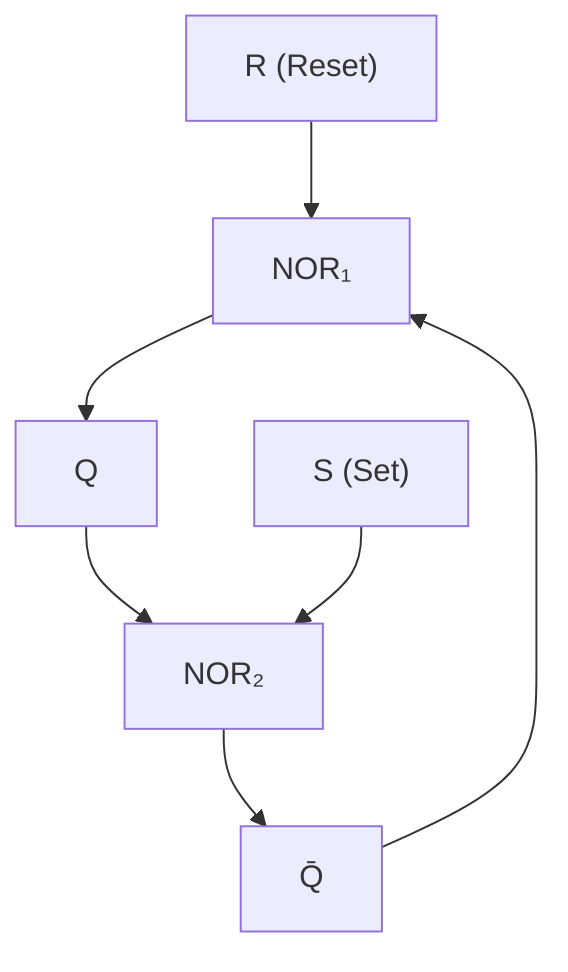
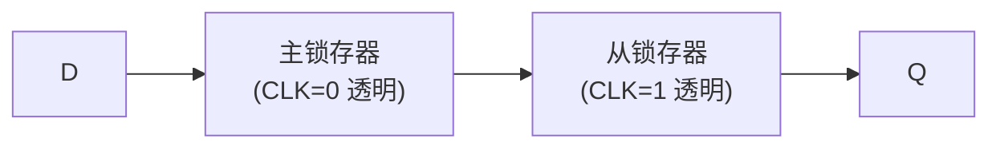
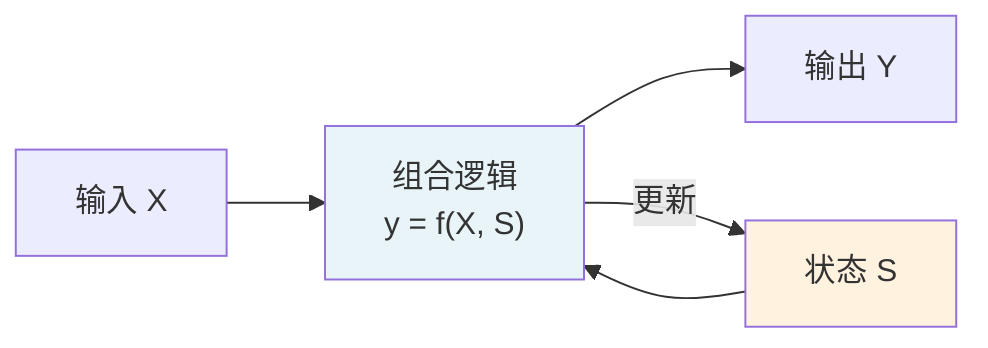

---
tags:
  - 电路学
  - 数字系统
  - 时序逻辑
  - 课程笔记
date: 2026-09-08
aliases:
  - 时序逻辑
  - 存储器
  - Sequential Logic
  - Memory
  - Sequential Circuit
  - 时序电路
---

# Sequential Logic（时序逻辑 / 存储器）

> [!NOTE] 本笔记定位
> 数字抽象的第二层——**组合逻辑（无记忆）**之后，[[Combinational Logic|组合逻辑]] 只看当前输入；时序逻辑**记住过去的状态**，这靠**存储元件（存储器）**实现。MIT 6.002 Lecture 6 核心内容。
> 与 [[Static Discipline|静态纪律]] 和 [[Combinational Logic|组合逻辑]] 构成 Ch.5 数字抽象三件套。
> 与 [[cs6.002x.1|知识树]] 互链。

---

## 一、组合逻辑的局限：为什么需要记忆？

组合逻辑（AND/OR/NOT/NAND/NOR 等）的输出**仅由当前输入决定**：
$$y = f(x_1, x_2, \dots, x_n)$$

> [!EXAMPLE] 组合逻辑 vs 时序逻辑
> - **组合**："如果按下开灯按钮，灯亮"（每次都响应，无记忆）
> - **时序**："按一下开/按一下关"（Toggle 触发器）——输出由**历史**决定

时序系统（Sequential System）的方程多了一个**状态变量**：
$$y = f(x_1, \dots, x_n,\; S)$$
$$S' = g(x_1, \dots, x_n,\; S)$$

其中 $S$ 是**存储的记忆状态**——这就是**存储器 (Memory)** 存在的意义。

---

## 二、双稳态元件 (Bistable)：存储的最基本单元

### 2.1 概念

**双稳态**即系统有两个稳定状态（0 和 1），在外加信号撤除后仍保持该状态——这是存储器的核心。

> [!IMPORTANT] 反馈 (Feedback) 是关键
> 把一个逻辑门的**输出接回到自己的输入**，形成**正反馈**，系统就会被"锁定"在某个状态。CMOS 反相器的互锁结构就是最简单的双稳态。

### 2.2 存储的物理本质

时序逻辑存储信息的本质是：

$$\boxed{\text{能量 + 正反馈 = 记忆}}$$

- **能量**：易失存储需要持续供电（SRAM 靠正反馈、DRAM 靠电容电荷且需周期刷新），非易失存储断电仍保持（Flash 靠浮栅电荷）
- **正反馈**：把输出拉回输入，形成双稳态

> [!NOTE] 数字 vs 模拟
> 数字存储器里仍然是**连续电压**，但[[Static Discipline|静态纪律]]把它量化成离散的 0/1。只要噪声容限够大，状态就不会跳变。

---

## 三、SR 锁存器 (SR Latch)：最简单的时序元件

SR 锁存器是最基础的时序单元，用两个 **NOR 门**或两个 **NAND 门**构成：

### 3.1 NOR 门 SR 锁存器

| S | R | Q | Q̄ | 说明 |
| :---: | :---: | :---: | :--- | :--- |
| 0 | 0 | 保持 | 保持 | 存储（无变化） |
| 1 | 0 | 1 | 0 | 置位 (Set) |
| 0 | 1 | 0 | 1 | 复位 (Reset) |
| 1 | 1 | 0 | 0 | **禁用（非法）** |

> [!WARNING] 禁用状态
> S=R=1 同时作用时，两个 NOR 门输出均为 0，违反了 Q 与 Q̄ 互补的基本约束。撤除时还可能进入**亚稳态 (metastable)**——两个输出在非法区边界徘徊。

### 3.2 时序真值表 (State Table)

| 当前状态 $Q$ | S | R | 下一状态 $Q'$ |
| :---: | :---: | :---: | :---: |
| 0 | 0 | 0 | 0（保持） |
| 0 | 1 | 0 | 1（置位） |
| 0 | 0 | 1 | 0（复位） |
| 1 | 0 | 0 | 1（保持） |
| 1 | 1 | 0 | 1 |
| 1 | 0 | 1 | 0 |

---

## 四、D 锁存器 / D 触发器 (D Latch / D Flip-Flop)

### 4.1 D 锁存器（电平触发）

在 SR 锁存器前加一个**反相器**防止禁用状态：
$$S = D,\quad R = \bar{D}$$

| CLK | D | Q | 说明 |
| :---: | :---: | :---: | :--- |
| 1 | 0 | 0 | 写入 0（透明 transparent，Q 跟随 D） |
| 1 | 1 | 1 | 写入 1（透明 transparent，Q 跟随 D） |
| 0 | × | 保持 | 锁存 (latched)，数据被保持 |

### 4.2 D 触发器（边沿触发，最常用）

把**两个 D 锁存器**串联，主从结构（Master-Slave）实现**边沿触发**：

- **正边沿触发**：CLK 从 0→1 时，Q 捕获 D 的当前值
- CLK=0 期间 D 的变化被主锁存器跟踪，但被从锁存器隔离（Q 不变）；时钟**上升沿**一到，主锁存器锁住 D 的当前值，从锁存器打开，该值立即传到 Q
- 一旦被捕获，D 的进一步变化不影响已锁住的 Q

> [!NOTE] 为什么用边沿触发？
> 组合逻辑的**毛刺/冒险 (hazard)**会污染电平触发器的输出。边沿触发只在**确定性的瞬间**采样，是数字系统时钟同步的基础。

---

## 五、时序系统的时钟同步

### 5.1 全局时钟 (Global Clock)

数字系统中所有触发器共用一个**时钟信号 (Clock)**，保证状态更新在精确的时刻同步发生：

$$Q_{n+1} = f(Q_n, X_n,\; \text{CLK})$$

### 5.2 建立时间 / 保持时间 (Setup / Hold Time)

> [!IMPORTANT] 触发器的两个关键时序参数
> - **建立时间 $t_{setup}$**：时钟边沿前 D 必须稳定的最短时间
> - **保持时间 $t_{hold}$**：时钟边沿后 D 必须保持稳定的最短时间
>
> 这两个约束来自触发器内部电路的传播延迟，是[[The Digital Abstraction|数字抽象]]从"理论"走向"现实实现"的关键缺口。

违反 $t_{setup}/t_{hold}$ 会导致**亚稳态 (metastability)**——输出不确定地徘徊在非法电压区，是数字系统的重大可靠性隐患。

---

## 六、存储器层次 (Memory Hierarchy)

| 存储器类型 | 速度 | 成本/bit | 典型应用 | 存储原理 |
| :--- | :--- | :--- | :--- | :--- |
| 寄存器 (Register) | 最快 | 最高 | CPU 内部 | 触发器阵列 |
| SRAM | 快 | 高 | Cache | 双稳态（6T 存储单元） |
| DRAM | 中 | 低 | 主存 | 电容电荷（需刷新） |
| Flash | 慢 | 最低 | 固态硬盘 | 浮栅 MOS 电荷捕获 |

> [!TIP] 从触发器到 DRAM 的物理逻辑
> 触发器 → SRAM → DRAM 是一段"存储原理"的抽象降级：SRAM 用**正反馈双稳态**，每单元 6 个晶体管（6T），速度快但面积大；主从 D 触发器更大（通常 20 管以上）；DRAM 用**电容**只占 1 个晶体管，但电荷会漏需要刷新——这是**面积/功耗/速度**三者的经典工程折中。

---

## 七、与组合逻辑的关系

**时序系统 = 组合逻辑 + 存储元件 + 反馈回路**

这与[[Small Signal Analysis|小信号分析]]里的"工作点 + 扰动"有异曲同工之处：
- 存储状态 $S$ ≈ 直流工作点 $Q$
- 组合逻辑 ≈ 小信号线性化响应
- 时钟边沿 ≈ 叠加原理中的"源单独作用"时刻

---

## 八、承前启后：时序逻辑与动态电路

| 数字时序 | 对应的模拟/连续时间概念 |
| :--- | :--- |
| 触发器的 $t_{setup}/t_{hold}$ | [[First-Order Transients]] 中的 $\tau = RC$ 延迟 |
| 时钟周期 | 系统能可靠工作的最小周期（由 $t_{pd}$ 决定） |
| 亚稳态 | 系统停在**不稳定平衡点**（类似"山顶的小球"：稍受扰动即滚向 0 或 1） |
| 状态变量 $Q_n$ | [[First-Order Transients]] 中的 $v_C$、$i_L$ |

> [!NOTE] 传播延迟 (Propagation Delay)
> 时钟周期的下限由传播延迟 $t_{pd}$ 决定（与[[The MOSFET Switch]]中的 $R_{ON}\cdot C_L$ 紧密相关）。详见 [[First-Order Transients]] 与 [[Energy and Power in Digital Circuits]]。

---

## 相关笔记

- [[Static Discipline]] —— 数字抽象的物理基础（噪声容限、四阈值）
- [[Combinational Logic]] —— 组合逻辑（无记忆，对比时序）
- [[The Digital Abstraction]] —— 数字抽象整体框架
- [[The MOSFET Switch]] —— 构成逻辑门的 MOSFET 基础
- [[First-Order Transients]] —— 时序系统延迟的时间常数物理
- [[Energy and Power in Digital Circuits]] —— 时序系统的功耗（动态功耗 $P_{dyn}\propto CV^2f$）
- [[cs6.002x.1]] —— 电路原理知识树（主笔记）
