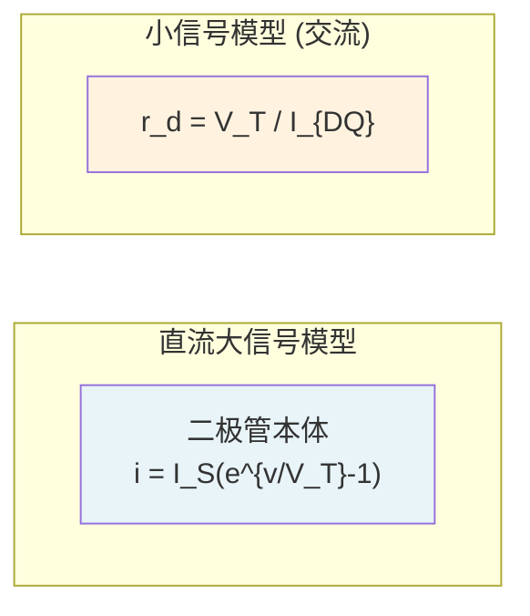
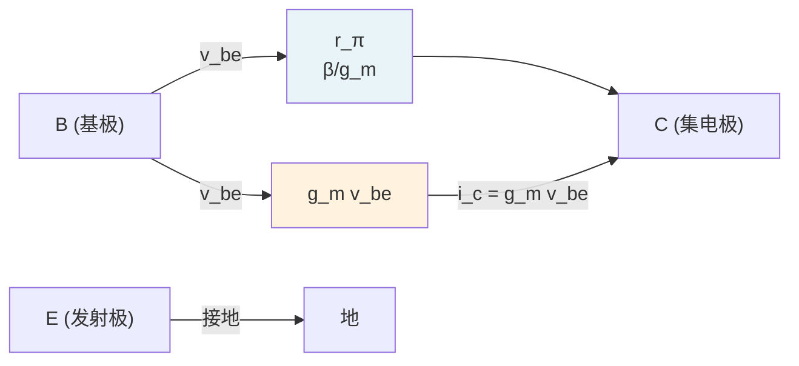
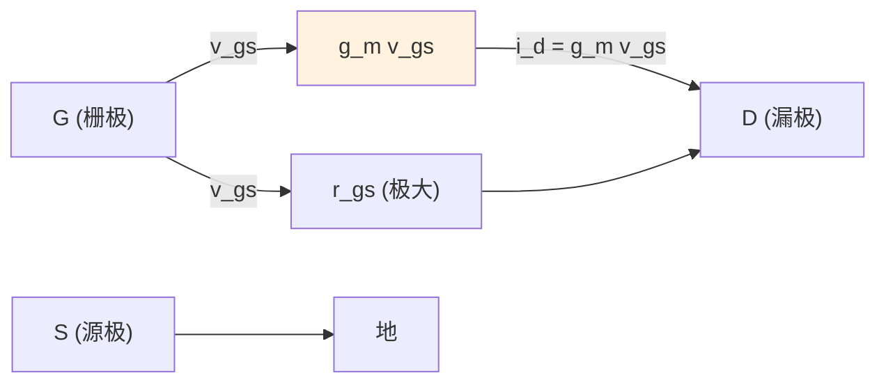
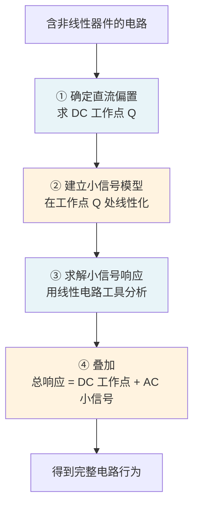

---
tags:
  - 电路学
  - 非线性电路分析
  - 信号处理
  - 课程笔记
date: 2026-08-15
aliases:
  - 小信号分析
  - Small-Signal Analysis
  - Small Signal
  - 小信号模型
  - Small-Signal Model
  - 小信号近似
---

# Small Signal Analysis (小信号分析)

> [!IMPORTANT] 核心定义
> **小信号分析 (Small Signal Analysis)** 是一种将**非线性器件**在特定**直流工作点 (Bias Point / Quiescent Point)** 附近**线性化**的分析方法，从而使我们能用熟悉的[[Superposition Theorem|叠加原理]]、[[Thevenin's Theorem|戴维南定理]]、[[Norton's Theorem|诺顿定理]]等线性工具来分析含非线性元件的电路。
>
> 核心思想：**"小扰动 → 线性近似"**——只要信号变化幅度足够小，非线性元件的行为可以用一条切线来近似。

---

## 一、物理直觉：为什么要做小信号分析？

### 1.1 非线性器件的现实困境

[[Kirchhoff's Laws|KCL/KVL]] 和我们熟悉的欧姆定律只对**线性元件**（电阻、电容、电感）直接成立。但现实电路中大量使用**非线性器件**，如：

| 非线性器件 | 典型 $I$–$V$ 特性 | 应用场景 |
| :--- | :--- | :--- |
| [[Circuit Theory Glossary#Devices Nonlinear Analysis\|Diode 二极管]] | $i = I_S(e^{v/V_T} - 1)$ | 整流、检波 |
| [[Circuit Theory Glossary#Devices Nonlinear Analysis\|Transistor 晶体管]] | $i_C = I_S e^{v_{BE}/V_T}$ | 放大、开关 |
| LED、光电二极管、热敏电阻…… | 非指数即幂律 | 传感器 |

这些元件的 $I$–$V$ 关系是**指数函数或幂函数**，直接列 KCL/KVL 方程会得到超越方程，无法手算解析解。

### 1.2 泰勒展开：非线性 ⇒ 线性

> [!NOTE] 泰勒近似的工程意义
> 任意光滑函数 $f(x)$，在工作点 $Q$（$x = V_{DQ}$）附近可展开为：
> $$f(V_{DQ} + \Delta v) \approx f(V_{DQ}) + \underbrace{\left.\frac{df}{dx}\right|_{x=V_{DQ}}}_{\text{常数}} \cdot \Delta v + \underbrace{\frac{1}{2}\left.\frac{d^2f}{dx^2}\right|_{x=V_{DQ}} (\Delta v)^2 + \cdots}_{\text{忽略（前提：}\Delta v\text{ 足够小）}}$$
>
> 当扰动 $\Delta v$ 很小时，**二次及以上项可以忽略**，函数在该点邻域内近似为**线性函数**。

这就是小信号分析的数学基础——**非线性函数的线性化**。

---

## 二、二极管小信号模型（经典示例）

### 2.1 直流 $I$–$V$ 特性

> [!NOTE] 二极管方程 (Diode Equation)
> $$i_D = I_S \left( e^{v_D / V_T} - 1 \right)$$
> - $I_S$：反向饱和电流（典型值：硅二极管 $\approx 10^{-12}\text{–}10^{-15}\text{ A}$）
> - $V_T = \dfrac{kT}{q} \approx 26\text{ mV}$（常温热电压）

### 2.2 直流工作点 $Q$ 的确定

在电路中给二极管加一个**直流偏置**（通常通过电阻分压或电流源），确定静态工作点：

$$I_{DQ} = I_S \left( e^{V_{DQ} / V_T} - 1 \right) \approx I_S e^{V_{DQ} / V_T} \quad (\text{正向导通时})$$

> [!TIP] 图解法：负载线 (Load Line)
> 也可以用**负载线法**在二极管的 $I$–$V$ 曲线上确定 $Q$ 点：
> - 电路约束：$i_D = \dfrac{V_{CC} - v_D}{R}$（直流回路方程）——一条斜率为 $-1/R$ 的直线
> - 元件特性：$i_D = f(v_D)$（指数曲线）
> - 交点即为 $Q$ 点 $(V_{DQ}, I_{DQ})$

### 2.3 小信号扰动：令 $v_D = V_{DQ} + \Delta v_D$

> [!IMPORTANT] 核心推导
> 将 $v_D = V_{DQ} + \Delta v_D$ 代入二极管方程，在 $V_{DQ}$ 处做泰勒展开并忽略高阶项：
> $$i_D = I_S e^{V_{DQ}/V_T} \cdot e^{\Delta v_D / V_T} \approx I_{DQ} \cdot \left( 1 + \frac{\Delta v_D}{V_T} \right) = \underbrace{I_{DQ}}_{\text{直流分量}} + \underbrace{\frac{I_{DQ}}{V_T} \cdot \Delta v_D}_{\text{小信号分量}}$$
>
> 定义**小信号电导 (Small-Signal Conductance)**：
> $$g_D = \frac{I_{DQ}}{V_T} = \frac{1}{r_d}$$
>
> 其中 $r_d$ 即为二极管的**小信号电阻 (Small-Signal Resistance)**。

### 2.4 小信号电路模型

> [!NOTE] 二极管小信号等效电路
> 在交流小信号下，二极管在工作点 $Q$ 处等效为一个**电阻** $r_d$：
> $$\boxed{r_d = \frac{V_T}{I_{DQ}}}$$
>
> - $V_T \approx 26\text{ mV}$（常温）
> - $I_{DQ}$ 以 mA 为单位时，$r_d \approx \dfrac{26\text{ mV}}{I_{DQ}\text{ (mA)}}$ Ω
>
> | $I_{DQ}$ | $r_d$ 近似值 |
> | :---: | :---: |
> | 1 mA | 26 Ω |
> | 10 mA | 2.6 Ω |
> | 0.1 mA | 260 Ω |

**物理直觉**：$Q$ 点电流越大，等效电阻越小——导通良好的二极管对交流信号"更短路"。

### 2.5 信号叠加：直流偏置 + 交流小信号

> [!NOTE] 叠加原理的直接应用
> 二极管两端的总电压 = 直流工作点电压 + 交流小信号扰动：
> $$v_D = V_{DQ} + \Delta v_D$$
> $$i_D = I_{DQ} + \Delta i_D = I_{DQ} + g_D \cdot \Delta v_D$$
>
> 这是 [[Superposition Theorem|叠加原理]] 在非线性器件中的巧妙应用：**直流确定工作点，交流在切线（线性化模型）上响应**。

---

## 三、晶体管 (BJT) 小信号模型

> [!NOTE] 背景：BJT 的放大功能
> 晶体管（Bipolar Junction Transistor）的核心功能是**电流放大**——小基极电流变化引起大集电极电流变化。小信号分析让我们量化这一放大能力。

### 3.1 直流工作点参数

| 符号 | 含义 | 典型值 |
| :--- | :--- | :--- |
| $I_{BQ}$ | 基极直流电流 | μA 级 |
| $I_{CQ}$ | 集电极直流电流 | mA 级 |
| $V_{CEQ}$ | 集-射极直流电压 | V 级 |
| $\beta$ | 直流电流放大系数 | 50 ~ 300 |

直流关系：$I_{CQ} = \beta I_{BQ}$

### 3.2 跨导 (Transconductance) $g_m$

> [!IMPORTANT] BJT 核心小信号参数
> 集电极电流对小信号 $v_{BE}$ 的敏感程度：
> $$g_m = \left.\frac{\partial i_C}{\partial v_{BE}}\right|_{Q} = \frac{I_{CQ}}{V_T} = \frac{\beta I_{BQ}}{V_T}$$
>
> | 典型值 | 说明 |
> | :---: | :---: |
> | $g_m \approx 40\text{ S}$（$I_{CQ} = 1\text{ mA}$） | $V_T \approx 26\text{ mV}$ 时 |

### 3.3 输入电阻 $r_\pi$

> [!NOTE] 基极-发射极间的小信号输入电阻
> $$r_\pi = \frac{\beta}{g_m} = \frac{\beta V_T}{I_{CQ}} \approx \frac{26\text{ mV} \cdot \beta}{I_{CQ}\text{ (mA)}}$$
>
> 典型值：$\beta = 100$，$I_{CQ} = 1\text{ mA}$ 时，$r_\pi \approx 2.6\text{ k}\Omega$

### 3.4 BJT 小信号等效电路（低频简化模型）

**三端小信号等效**：
- **B–E 之间**：电阻 $r_\pi$（输入端）
- **C–E 之间**：受控电流源 $g_m v_{be}$（输出端）

### 3.5 电压增益估算

> [!EXAMPLE] 基本共射放大器
> 电路：$v_{in}$ 通过耦合电容加到基极，集电极通过负载 $R_C$ 接 $V_{CC}$，射极接地。
>
> 小信号电压增益：
> $$A_v = \frac{v_{out}}{v_{in}} = \frac{-i_c R_C}{v_{be}} = \frac{-g_m v_{be} R_C}{v_{be}} = -g_m R_C$$
>
> 负号表示**反相**（共射放大器输出与输入相位差 180°）。这就是小信号分析的核心应用——**计算放大器增益**。

---

## 四、 MOSFET 小信号模型

### 4.1 直流关系（饱和区）

$$I_{DS} = \frac{1}{2} \mu_n C_{ox} \frac{W}{L} (V_{GS} - V_{th})^2 = \frac{1}{2} K (V_{GS} - V_{th})^2$$

### 4.2 跨导 $g_m$

> [!IMPORTANT] MOSFET 核心参数
> $$g_m = \left.\frac{\partial i_D}{\partial v_{GS}}\right|_Q = K(V_{GSQ} - V_{th}) = \sqrt{2K I_{DQ}}$$
>
> | 特点 | 说明 |
> | :---: | :---: |
> | $g_m \propto \sqrt{I_{DQ}}$ | 电流越大，跨导越大 |
> | $g_m$ 与 $\beta$ 成正比 | $K = \mu_n C_{ox} W/(2L)$ |

### 4.3 MOSFET 小信号等效电路（低频）

---

## 五、一般分析步骤 (Procedure)

### Step 1：直流分析（求工作点 $Q$）

- **所有交流源置零**（电压源短路、电流源开路）
- 用 KCL/KVL、欧姆定律求出各节点的**直流电压**
- 确定器件的**直流电流 $I_{DQ}$、直流电压 $V_{DQ}$**
- 这是后续小信号参数的**基准点**

### Step 2：建立小信号模型

- 将非线性器件替换为对应的小信号等效电路：
  - 二极管 → $r_d = V_T / I_{DQ}$
  - BJT → $r_\pi$ 与受控源 $g_m v_{be}$
  - MOSFET → $g_m$ 与受控源 $g_m v_{gs}$
- **保留电路中所有线性元件**（电阻、电容、电感）不变
- **保留所有受控源**（它们是线性的）

### Step 3：小信号交流分析

- **所有直流源置零**（电压源短路、电流源开路）
- 在小信号等效电路中，用[[Superposition Theorem|叠加原理]]、[[Thevenin's Theorem|戴维南]]/[[Norton's Theorem|诺顿]]等工具求解 $\Delta v$、$\Delta i$

### Step 4：叠加

$$v_{total} = V_Q + \Delta v, \qquad i_{total} = I_Q + \Delta i$$

---

## 六、重要概念辨析

### 6.1 小信号 vs 大信号

| 特性 | 小信号 (Small Signal) | 大信号 (Large Signal) |
| :--- | :--- | :--- |
| 幅值 | 远小于 $V_T$（约几 mV） | 与 $V_T$ 量级相当或更大 |
| 近似方法 | 线性化（泰勒展开一阶项） | 必须用完整非线性方程 |
| 分析工具 | 线性电路工具（叠加、戴维南） | 图解法、数值迭代 |
| 典型场景 | 放大器小增益分析、滤波器 | 开关电路、数字逻辑、整流 |

> [!WARNING] 小信号近似的适用范围
> 小信号模型**只在工作点 $Q$ 附近有效**。当扰动幅度增大时，非线性高阶项不可忽略，线性近似失效。
> 工程中常要求 $\Delta v \lesssim 10\text{ mV}$（$\approx 0.4 V_T$）作为"小信号"的粗略标准。

### 6.2 小信号分析与叠加原理的关系

> [!NOTE] 理论联系
> 小信号分析的底层逻辑是[[Superposition Theorem|叠加原理]]——直流偏置确定**线性化切线的位置**（工作点），交流小信号在**这条切线代表的线性系统**上响应。
>
> 形式上可写为：
> $$\text{总响应} = \underbrace{f(V_{DQ})}_{\text{直流}} + \underbrace{\left.\frac{df}{dx}\right|_{V_{DQ}} \cdot \Delta v}_{\text{小信号线性叠加}} + \underbrace{\text{高阶项}}_{\approx 0}$$
>
> 这与线性电路中"各独立源单独作用的响应之和"本质相同。

### 6.3 小信号分析与戴维南/诺顿的关系

[[Thevenin's Theorem|戴维南定理]]和[[Norton's Theorem|诺顿定理]]提供了**化简线性电路**的有效工具。在小信号分析中：
- 我们在**小信号等效电路**（线性）内应用这些定理
- 特别适用于求**放大器的输入电阻、输出电阻、增益**等指标

---

## 七、频率响应初步（承前启后）

> [!TIP] 从时域到频域
> 上述小信号模型默认所有电容、电感的阻抗为：**直流下开路（隔直）/ 短路（耦合）**。这是低频近似。
>
> 在更高频率下：
> - **耦合电容**、**旁路电容**的阻抗不可忽略（高频衰减）
> - **极间电容**（BJT 的 $C_\pi$、$C_\mu$；MOSFET 的 $C_{gs}$、$C_{gd}$）开始起作用
>
> 这引出了**放大器频率响应**的完整分析，将在后续专题深入。

---

## 八、典型应用场景

| 应用 | 说明 |
| :--- | :--- |
| **放大器增益计算** | BJT/MOSFET 放大器的小信号电压增益 $A_v = -g_m R_C$ |
| **输入/输出电阻分析** | 用戴维南等效求放大器的 $R_{in}$、$R_{out}$ |
| **二极管交流电阻** | 整流电路中二极管对交流信号的"导通程度" |
| **滤波器设计** | 含非线性器件（变容二极管）的调谐电路 |
| **传感器接口电路** | 热敏、光敏等传感器的线性化放大 |

---

## 相关笔记

- [[Superposition Theorem]] —— 小信号分析的理论基础（线性叠加）
- [[Thevenin's Theorem]] / [[Norton's Theorem]] —— 线性电路化简工具，用于求 $R_{in}$、$R_{out}$、增益
- [[Kirchhoff's Laws]] —— 直流工作点分析的基础
- [[Lumped Matter Discipline]] —— 集总模型假设是小信号分析有效的前提
- [[Complex Numbers and Euler's Formula]] —— 后续频域分析（阻抗）的数学基础
- [[Circuit Theory Glossary]] —— 术语表
- [[cs6.002x.1]] —— 电路原理知识树（主笔记）
