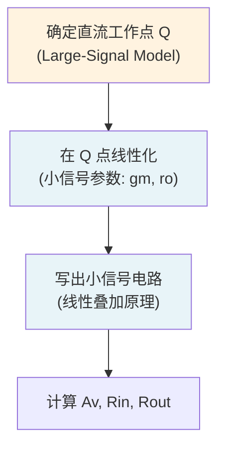

---
tags:
  - 电路学
  - 放大器
  - 小信号分析
  - 课程笔记
date: 2026-09-08
aliases:
  - Small Signal Circuit Representation
  - 小信号电路表示
  - 小信号模型
  - 小信号增益
  - Small Signal Gain
  - Input Resistance
  - Output Resistance
  - Small-Signal Parameters
---

# Small Signal Circuit Representation（小信号电路表示）

> [!NOTE] 本笔记定位
> 放大器分析的**第二阶段**：在 [[Large-Signal Model|大规模信号模型]] 确定直流工作点 (Q point) 后，把**小扰动**叠加在直流偏置上，对电路做**线性化**，得到小信号参数（$g_m$、$r_\pi$、$r_o$）与关键性能指标（增益 $A_v$、输入电阻 $R_{in}$、输出电阻 $R_{out}$）。
> 与 [[Small Signal Analysis]]（BJT 侧）互为补充；与 [[The MOSFET Amplifier]] 直接关联。
> 与 [[cs6.002x.1|知识树]] 互链。

---

## 一、为什么需要小信号表示？

当输入信号足够小（相对于直流偏置的线性范围）时，可以把放大器**在 Q 点附近线性化**：

$$i_D(v_{GS}) \approx I_D(Q) + g_m\,(v_{gs}) + \frac{v_{gs}}{r_o}$$

- **直流分量**：由 [[Large-Signal Model|大信号模型]] 决定工作点 $I_D(Q)$
- **交流分量（小信号）**：线性关系 $g_m v_{gs}$（一阶近似）

> [!IMPORTANT] 线性化的意义
> 线性化之后，**叠加原理（[[Superposition Theorem]]）可以直接使用**——每个源（直流、交流、信号源）单独作用的结果可以代数相加。这使得电路分析大大简化。

---

## 二、MOSFET 小信号模型

### 2.1 饱和区小信号参数

MOSFET 在饱和区（$v_{DS}>v_{GS}-V_t$）的小信号线性模型：

![[small_signal_mosfet.svg]]

| 参数 | 名称 | 定义 | 物理含义 |
| :--- | :--- | :--- | :--- |
| $g_m$ | **跨导 (transconductance)** | $g_m = \dfrac{\partial i_D}{\partial v_{GS}}\big|_{Q}$ | 栅压对漏极电流的控制能力 |
| $r_o$ | **输出电阻 (output resistance)** | $r_o = \dfrac{\partial v_{DS}}{\partial i_D}\big|_{Q}$ | 沟道长度调制效应（有限输出阻抗） |

**饱和区平方律公式：**
$$g_m = 2K(V_{GS}-V_t) \quad\text{或}\quad g_m = \frac{2I_D}{V_{GS}-V_t}$$
$$r_o = \frac{1}{\lambda I_D} \quad(\lambda:\text{沟道长度调制系数})$$

> [!TIP] $g_m$ 的两个等价表达式
> 从 $I_D = \frac12 K (V_{GS}-V_t)^2$ 求偏导：
> - 用过驱电压表示：$g_m = 2K(V_{GS}-V_t) = \frac{2I_D}{V_{GS}-V_t}$（常用于电路设计）
> - 用 $I_D$ 表示：$g_m = \sqrt{2KI_D}$（常用于已知 $I_D$ 时）

### 2.2 完整小信号模型（含 $r_o$）

$$\boxed{y\text{-参数矩阵形式：}\;\begin{bmatrix}i_d\\v_{ds}\end{bmatrix} = \begin{bmatrix}g_m & 0\\0 & 1/r_o\end{bmatrix}\begin{bmatrix}v_{gs}\\i_d\end{bmatrix}}$$

实际电路中 $r_o$ 常被忽略（当 $r_o \gg R_D$ 时），但**共源共栅 (cascode)** 等结构必须保留 $r_o$ 才能正确分析。

---

## 三、共源放大器 (Common-Source Amplifier) 的小信号分析

### 3.1 电路结构

![[cs_amplifier_stage.svg]]

### 3.2 电压增益 $A_v$

从栅到漏的小信号路径：

$$v_{gs} = v_{\text{in}}, \quad i_d = g_m v_{gs}$$

在漏极节点对 $v_{\text{out}}$ 列 KCL（$R_D$ 向下、$r_o$ 向上）：
$$\frac{v_{\text{out}}}{R_D} + \frac{v_{\text{out}}}{r_o} + g_m v_{\text{in}} = 0$$
$$\Rightarrow \boxed{A_v = \frac{v_{\text{out}}}{v_{\text{in}}} = -g_m\,(R_D \| r_o)}$$

> [!IMPORTANT] 负号的意义
> **共源放大器反相**——输入电压升高 → 栅压升高 → 漏极电流增大 → $R_D$ 上压降增大 → 输出电压降低。这是 CS 放大器的本质特征（180° 相移）。

忽略 $r_o$（$r_o \gg R_D$）时：$A_v \approx -g_m R_D$

### 3.3 输入电阻 $R_{in}$

MOSFET 栅极与源极之间是**绝缘的氧化层**，输入电阻**理论上无限大**：
$$\boxed{R_{in} = \infty \quad\text{(理想 MOSFET)}$$
实际中受到 **$C_{gd}, C_{gs}$ 容性负载**限制（高频时 $Z_{in}=1/(j\omega C_{in})$）。

### 3.4 输出电阻 $R_{out}$

从输出端看进去（令 $v_{\text{in}}=0$，即 $v_{gs}=0$）：
$$\boxed{R_{out} = R_D \| r_o \approx R_D \quad(\text{当 } r_o \gg R_D\text{)}}$$

---

## 四、关键性能指标汇总

| 指标 | 共源 (CS) | 共漏 (CD / Source Follower) | 共栅 (CG) |
| :--- | :--- | :--- | :--- |
| 电压增益 $|A_v|$ | $g_m(R_D\|r_o)$ | $\approx 1$（无反相） | $g_m(R_D\|r_o)$（同相） |
| 输入电阻 | $\infty$（栅极绝缘） | $\infty$ | $\approx 1/g_m$（低） |
| 输出电阻 | $R_D\|r_o$（高） | $\approx 1/g_m$（低） | $R_D\|r_o$（高） |
| 相移 | $180^\circ$ | $0^\circ$ | $0^\circ$ |

> [!NOTE] 三种组态的应用场景
> - **CS**：反相放大（最常用），功率放大中间级
> - **CD（源极跟随器）**：阻抗变换（高输入阻抗、低输出阻抗）——缓冲级
> - **CG**：电流放大 / 高频（无密勒效应）

---

## 五、密勒效应 (Miller Effect) 与高频限制

### 5.1 密勒定理

在反向放大器中（$A_v\approx -g_m R_D$），$C_{gd}$（栅–漏电容）等效为输入端一个更大的电容：

$$\boxed{C_{\text{Miller}} = C_{gd}\,(1+|A_v|)}$$

> [!WARNING] 密勒效应的危害
> $C_{\text{Miller}}$ 与输入电阻构成新的低通极点，把 **-3dB 带宽**压缩到远低于预期的高频。共源放大器的高速设计必须**抑制密勒效应**（用 CG 或 cascode 结构）。

### 5.2 高频时间常数

$$f_{-3\text{dB}} = \frac{1}{2\pi\,R_{\text{source}} C_{\text{Miller}}}$$

这与 [[First-Order Transients]] 中的 $RC$ 时间常数物理本质相同，只是从**频域（阻抗）**角度描述。

---

## 六、工作点 Q 对小信号参数的影响

从 $g_m = \sqrt{2KI_D}$ 可以看出：

| Q 点条件 | $I_D$ | $g_m$ | $|A_v|=g_mR_D$ |
| :--- | :--- | :--- | :--- |
| 高电流偏置 | 大 | 大 | 高（但功耗也大） |
| 低电流偏置 | 小 | 小 | 低（功耗也低） |
| 固定 $V_{GS}$，$R_D$ 增大 | 略增 | 略增 | 增大（主因是 $R_D$） |

> [!TIP] 增益-带宽折中
> $g_m = 2K(V_{GS}-V_t)$ 表明：增大过驱电压可以提高 $g_m$，但同时会改变 Q 点位置、增加功耗。**增益 $g_mR_D$ 与带宽**之间存在经典折中（类似 [[Maximum Power Transfer Theorem|最大功率传输]] 中的效率折中）。

---

## 七、与 [[Large-Signal Model]] 的关系

> [!NOTE] 重要约束
> 小信号模型**只在线性区有效**。当输入信号摆幅过大（使器件离开饱和区进入三极管或截止区），小信号模型失效，**失真 (distortion)** 出现。这是 [[Large-Signal Model]] 中"大信号非线性"分析的范畴。

---

## 相关笔记

- [[Large-Signal Model]] —— 直流工作点的确定（Q 点分析）
- [[Small Signal Analysis]] —— BJT 侧的小信号参数（$g_m$、$r_\pi$、$r_o$ 对比）
- [[The MOSFET Amplifier]] —— 共源 / 共漏 / 共栅放大器的完整电路分析
- [[MOSFET]] —— 器件物理与饱和区平方律
- [[Superposition Theorem]] —— 小信号线性化的理论基础
- [[First-Order Transients]] —— 密勒效应与高频时间常数的物理（$RC$ 延迟）
- [[Energy and Charge Conservation]] —— 储能（$C$ 充放电、$L$ 充磁）与增益/带宽的关系
- [[cs6.002x.1]] —— 电路原理知识树（主笔记）
