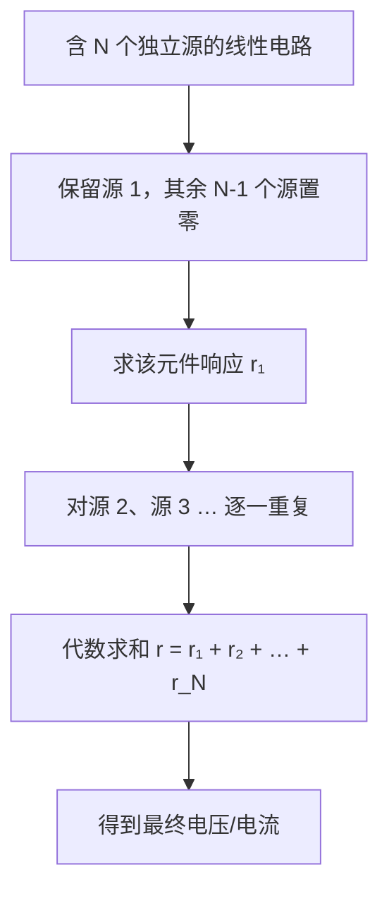

---
tags:
  - 电路学
  - 电路分析方法
  - 课程笔记
date: 2026-08-15
aliases:
  - 叠加原理
  - 叠加定理
  - 叠加
  - Superposition Theorem
  - Superposition Principle
---

# 叠加原理 (Superposition Theorem)

> [!IMPORTANT] 核心定义
> 在含有**多个独立源**的**线性电路**中，任一元件上的**电压或电流**，等于每个独立源**单独作用**时在该元件上产生的电压或电流的**代数和**。
> 叠加原理是**线性系统**的普适性质（Linearity）在电路中的直接应用。

---

## 一、适用前提：线性电路 (Linear Circuit)

叠加原理**只对线性电路成立**。线性电路需满足：

1. **齐次性 (Homogeneity)**：输入放大 $k$ 倍，输出也放大 $k$ 倍（$f(kx) = kf(x)$）。
2. **可加性 (Additivity)**：多个输入共同作用 = 各自单独作用之和（$f(x_1 + x_2) = f(x_1) + f(x_2)$）。

> [!NOTE] 为什么"线性"是关键
> 由电阻 (Resistor)、电容 (Capacitor)、电感 (Inductor) 与**线性受控源**构成的电路，其电压/电流关系都是线性方程（KCL/KVL 是线性方程组），因此满足叠加。而含二极管、晶体管等**非线性元件**的电路不适用（除非先做 [[小信号分析|Small Signal Analysis]] 线性化）。

---

## 二、核心操作：独立源的"置零" (Zeroing)

叠加时，每次只保留**一个**独立源，其余独立源按以下规则"置零"：

| 源类型 | 置零操作 | 英文 | 原因 |
| :--- | :--- | :--- | :--- |
| **电压源** | 短路 | Short circuit | 理想电压源电压恒为 0 ⇒ 等效为一根导线 |
| **电流源** | 开路 | Open circuit | 理想电流源电流恒为 0 ⇒ 等效为断路 |

> [!WARNING] 受控源不能置零！
> **受控源 (Dependent Source)** 不是独立源，它的值由电路中其他量决定，**必须保留**，不能短路/开路。

---

## 三、求解步骤 (Procedure)

1. **逐个激活**：每次只保留一个独立源，其余独立源全部置零。
2. **分别求解**：用 [[Kirchhoff's Laws|KCL/KVL]]、欧姆定律等，求出目标元件在该源单独作用下的响应（电压或电流）。
3. **代数求和**：把所有响应按**参考方向一致**的原则**代数相加**（注意正负号，不是简单绝对值和）。
4. **注意**：多个独立源也可以**分组**处理，不必严格"一次只留一个"，只要保证每组叠加覆盖所有源即可。

---

## 四、示例：两个电压源的分压电路

> [!EXAMPLE] 例题
> 电路：$V_1$ 与 $V_2$ 两个电压源，分别与电阻 $R_1$、$R_2$ 串联后，对公共节点供电。求节点电压 $v$。

**步骤 1**：保留 $V_1$，$V_2$ 置零（短路）。
$$v_1 = V_1 \cdot \frac{R_2}{R_1 + R_2}$$

**步骤 2**：保留 $V_2$，$V_1$ 置零（短路）。
$$v_2 = V_2 \cdot \frac{R_1}{R_1 + R_2}$$

**步骤 3**：代数求和。
$$v = v_1 + v_2 = \frac{V_1 R_2 + V_2 R_1}{R_1 + R_2}$$

---

## 五、注意事项 (Pitfalls)

> [!WARNING] 功率不能用叠加原理！
> **功率 $P = I^2 R = \dfrac{V^2}{R}$ 是电压/电流的二次函数，不满足线性叠加。**
> 必须先分别求出各源的电压/电流并求和，**再**用总电压、总电流计算总功率；绝不能把各源单独作用时的功率直接相加。

> [!NOTE] 适用对象限定
> - ✅ 可叠加：**电压、电流**（线性量）。
> - ❌ 不可叠加：**功率、能量**（非线性量）。

> [!TIP] 叠加原理 vs 戴维南/诺顿
> 叠加原理是**线性电路诸多定理的理论基石**——[[Thevenin's Theorem|戴维南定理]]、[[Norton's Theorem|诺顿定理]] 的推导都依赖"线性 ⇒ 可叠加"这一前提。三者同属**线性电路分析工具箱**，常配合使用。

---

## 相关笔记

- [[cs6.002x.1开头]] —— 电路基础概念与基本定律（主笔记，其中已引用本文）
- [[Maxwell's Equations]] —— 电磁学基础
- [[Lumped Matter Discipline]] —— 集总事物理论（KCL/KVL 的理论来源）
