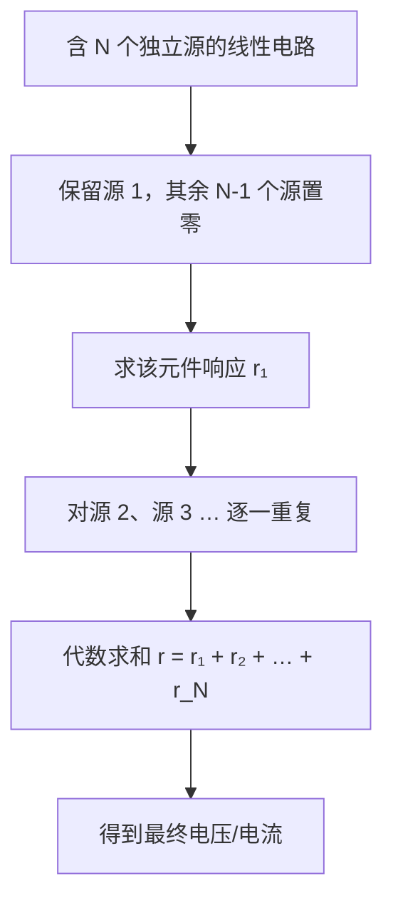

---
tags:
  - 电路学
  - 电路分析方法
  - 课程笔记
date: 2026-08-15
aliases:
  - 叠加原理
  - 叠加定理
  - 叠加
  - Superposition Theorem
  - Superposition Principle
---

# 叠加原理 (Superposition Theorem)

> [!IMPORTANT] 核心定义
> 在含有**多个独立源**的**线性电路**中，任一元件上的**电压或电流**，等于每个独立源**单独作用**时在该元件上产生的电压或电流的**代数和**。
> 叠加原理是**线性系统**的普适性质（Linearity）在电路中的直接应用。

---

## 一、适用前提：线性电路 (Linear Circuit)

叠加原理**只对线性电路成立**。线性电路需满足：

1. **齐次性 (Homogeneity)**：输入放大 $k$ 倍，输出也放大 $k$ 倍（$f(kx) = kf(x)$）。
2. **可加性 (Additivity)**：多个输入共同作用 = 各自单独作用之和（$f(x_1 + x_2) = f(x_1) + f(x_2)$）。

> [!NOTE] 为什么"线性"是关键
> 由电阻 (Resistor)、电容 (Capacitor)、电感 (Inductor) 与**线性受控源**构成的电路，其电压/电流关系都是线性方程（KCL/KVL 是线性方程组），因此满足叠加。而含二极管、晶体管等**非线性元件**的电路不适用（除非先做小信号分析 (Small Signal Analysis) 线性化）。

---

## 二、核心操作：独立源的"置零" (Zeroing)

叠加时，每次只保留**一个**独立源，其余独立源按以下规则"置零"：

| 源类型     | 置零操作 | 英文            | 原因                    |
| :------ | :--- | :------------ | :-------------------- |
| **电压源** | 短路   | Short circuit | 理想电压源电压恒为 0 ⇒ 等效为一根导线 |
| **电流源** | 开路   | Open circuit  | 理想电流源电流恒为 0 ⇒ 等效为断路   |

> [!WARNING] 受控源不能置零！
> **受控源 (Dependent Source)** 不是独立源，它的值由电路中其他量决定，**必须保留**，不能短路/开路。

---

### 电流源详解 (Current Source)

#### 2.1 定义与本质

**电流源 (Current Source)** 是一种能够向外电路提供规定电流的**活跃元件**，且其输出电流大小**完全独立于**它两端的电压。为了维持设定的电流，电流源理论上可以产生任何所需的电压。

> [!TIP] 对比记忆：电压源 vs 电流源
> - **电压源**：电压 $V_s$ 恒定，电流 $I$ 由负载决定（$I = V_s/R$）。
> - **电流源**：电流 $I_s$ 恒定，端电压 $V$ 由负载决定（$V = I_s R$）。

电流源的核心特性：**强制规定支路电流**，而非电压。这是它与电压源最根本的区别。

#### 2.2 分类

##### （1）独立电流源 (Independent Current Source)

输出电流是独立存在的，不依赖于电路中其他物理量。

- **理想模型**：内阻为无穷大（等效为开路），输出电流恒定（直流）或按给定时间函数变化（交流），两端电压完全由外接负载决定。
- **实际生活中的例子**：
  - **光电池 / 太阳能电池**：在工作状态下特性接近理想电流源，等效为理想电流源与电阻并联的组合。
  - **恒流二极管 (Constant Current Diode, JFET 恒流源)**：将 JFET 的栅极与源极短接（$V_{GS}=0$），漏极电流固定为 $I_{DSS}$，无需外加元件，是商品化的 2 端恒流器件。
  - **晶体管恒流电路 (BJT Current Source)**：在放大器电路中，用 BJT 搭配分压电阻构建恒流源，作为"有源负载"替代传统电阻，即使负载变化也能提供稳定电流。

##### （2）受控电流源 (Dependent Current Source)

输出电流受电路中其他位置的电压或电流控制。

- **场效应管 (FET)**：漏极电流受栅极电压控制，特性接近**电压控制电流源 (VCCS, Voltage-Controlled Current Source)**，常以其作为理想化模型。
- **双极型晶体管 (BJT)**：集电极电流受基极电流控制，特性接近**电流控制电流源 (CCCS, Current-Controlled Current Source)**。

> [!NOTE] 受控源的叠加处理
> 如前所述，**受控源不能置零**（见上方警告）。叠加时，受控源必须保留在电路中参与分析，因为它依赖于电路中其他量——将其他独立源置零时，受控源的控制量变为 0，受控源本身也会随之归零，这正是受控源"自动置零"的机制，而非人为强制置零。

#### 2.3 接入电路：串并联规则

电流源作为**二端元件**接入电路支路，符号为带箭头的圆圈（箭头代表电流参考方向）。

##### 可以：并联叠加

多个电流源**并联**接入电路时，可以等效为一个单一电流源：
$$I_{\text{eq}} = I_{s1} + I_{s2} + \cdots + I_{sn}$$

> 物理直觉：KCL——并联节点的电流之和 = 总电流。方向与参考方向一致者取正，相反者取负。

##### 严禁：不同电流值串联

两个电流值**不相等**的理想电流源**不能串联**：

$$I_{s1} \neq I_{s2} \Rightarrow \text{在连接点违背 KCL，无解}$$

> 物理原因：串联支路中电流必须处处相等。如果串联两个不同值的电流源，则在某节点 $I_{s1}$ 流入、$I_{s2}$ 流出，$I_{s1}\neq I_{s2}$，违反 KCL，这在物理上和数学上均无意义。
>
> **特例**：只有两个**完全相同**（方向一致、大小相等）的电流源才可以同向串联，等效为一个更大的电流源。

#### 2.4 电流源在叠加原理中的处理

| 操作         | 对电流源的影响                   |
| :--------- | :------------------------ |
| **激活**（保留） | 电流源正常工作，向所在支路注入 $I_s$     |
| **置零（开路）** | 该支路断开，电流源不再向电路注入电流        |
| **受控源**    | 保留；控制量为 0 时受控源自动归零，无需人为置零 |

> [!EXAMPLE] 叠加示例：含电流源的电路
> 电路：电流源 $I_s$ 与电压源 $V_s$ 并联，驱动负载电阻 $R_L$。求 $R_L$ 上电压 $v$。
>
> **步骤 1**：保留电流源 $I_s$，电压源 $V_s$ 置零（短路）。
> - 电压源短路后，$R_L$ 直接并联在电流源两端。
> - $v_1 = I_s \cdot R_L$
>
> **步骤 2**：保留电压源 $V_s$，电流源 $I_s$ 置零（开路）。
> - 电流源开路，$R_L$ 直接接在短路的电压源两端。
> - $v_2 = V_s$（电压源直接加在 $R_L$ 上，因短路把 $R_L$ 另一端强行拉到与电压源同电位）
>
> **步骤 3**：代数求和。
> $$v = v_1 + v_2 = I_s R_L + V_s$$

#### 2.5 工程实例：射极恒流源

在晶体管放大器（射极跟随器 / 共射放大器）中，工程师常将晶体管构成的恒流源直接串入发射极支路，替代传统发射极电阻：

![[bjt_current_source.svg]]

> [!TIP] 电路说明
> BJT 恒流源（分压偏置结构）：$+V_{CC}$ 经 $R_1$、$R_2$ 分压得到基极电位 $V_B$；晶体管 $Q_1$ 工作于放大区，发射极电阻 $R_e$ 设定的电流 $I_E$ 使集电极输出恒定电流
> $$I_C \approx \frac{V_B - V_{BE}}{R_e}$$
> 对负载呈现**“直流用恒流源、交流看小信号电阻”**的双重身份，既稳定直流工作点，又使小信号效率最大化。

- **目的**：提供恒定的发射极电流 $I_E$，即使负载变化也能维持稳定工作点。
- **效果**：相当于一个**阻值可动态调节的电阻**——大信号时自动增大等效阻抗，小信号时等效为低阻，提升电路效率并扩大输出动态范围。
- **在叠加分析中的含义**：直流恒流源确定**直流工作点**（决定线性化切线位置），交流小信号在切线代表的线性系统上响应，两者分别对应叠加中的"直流源置零/交流源置零"。

---

## 三、求解步骤 (Procedure)

1. **逐个激活**：每次只保留一个独立源，其余独立源全部置零（电压源短路，电流源开路；受控源保留不动）。
2. **分别求解**：用 [[Kirchhoff's Laws|KCL/KVL]]、欧姆定律等，求出目标元件在该源单独作用下的响应（电压或电流）。
3. **代数求和**：把所有响应按**参考方向一致**的原则**代数相加**（注意正负号，不是简单绝对值和）。
4. **注意**：多个独立源也可以**分组**处理，不必严格"一次只留一个"，只要保证每组叠加覆盖所有源即可。

---

## 四、示例：两个电压源的分压电路

> [!EXAMPLE] 例题
> 电路：$V_1$ 与 $V_2$ 两个电压源，分别与电阻 $R_1$、$R_2$ 串联后，对公共节点供电。求节点电压 $v$。

**步骤 1**：保留 $V_1$，$V_2$ 置零（短路）。
$$v_1 = V_1 \cdot \frac{R_2}{R_1 + R_2}$$

**步骤 2**：保留 $V_2$，$V_1$ 置零（短路）。
$$v_2 = V_2 \cdot \frac{R_1}{R_1 + R_2}$$

**步骤 3**：代数求和。
$$v = v_1 + v_2 = \frac{V_1 R_2 + V_2 R_1}{R_1 + R_2}$$

---

## 五、注意事项 (Pitfalls)

> [!WARNING] 功率不能用叠加原理！
> **功率 $P = I^2 R = \dfrac{V^2}{R}$ 是电压/电流的二次函数，不满足线性叠加。**
> 必须先分别求出各源的电压/电流并求和，**再**用总电压、总电流计算总功率；绝不能把各源单独作用时的功率直接相加。

> [!NOTE] 适用对象限定
> - ✅ 可叠加：**电压、电流**（线性量）。
> - ❌ 不可叠加：**功率、能量**（非线性量）。

> [!WARNING] 电流源串并联禁忌
> - ✅ 不同电流源可**并联**（代数叠加）
> - ❌ 不同电流值电流源**不能串联**（违背 KCL）

> [!TIP] 叠加原理 vs 戴维南/诺顿
> 叠加原理是**线性电路诸多定理的理论基石**——[[Thevenin's Theorem|戴维南定理]]、 [[Norton's Theorem|诺顿定理]] 的推导都依赖"线性 ⇒ 可叠加"这一前提。三者同属**线性电路分析工具箱**，常配合使用。

---

## 六、相关笔记

- [[Maxwell's Equations]] —— 电磁学基础
- [[Lumped Matter Discipline]] —— 集总事物理论（KCL/KVL 的理论来源）
- [[Kirchhoff's Laws]] —— KCL/KVL（叠加分析的基本工具）
- [[Thevenin's Theorem]] / [[Norton's Theorem]] —— 线性电路化简工具
- [[Small Signal Analysis]] —— 非线性器件线性化（小信号分析的动机）
- [[Circuit Theory Glossary]] —— 电路理论术语表
