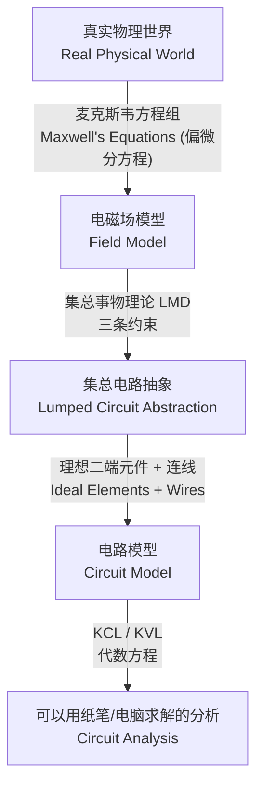

---
tags:
  - 电路学
  - 电路抽象
  - 课程笔记
date: 2026-09-06
aliases:
  - 电路抽象
  - 集总电路抽象
  - The Circuit Abstraction
  - Circuit Abstraction
  - 抽象的威力
---

# The Circuit Abstraction（电路抽象）

> [!NOTE] 本笔记定位
> 对应教材 Ch.1 *The Circuit Abstraction*。承接 [[Lumped Matter Discipline|集总事物理论 (LMD)]] 与 [[Maxwell's Equations|麦克斯韦方程组]]，解释**为什么我们可以把复杂的电磁世界"抽象"成由元件和连线组成的电路**，并建立后续所有分析方法（KCL/KVL/节点法）的合法性基础。
> 本笔记为专题笔记，详细推导沉淀于此；与 [[cs6.002x.1|知识树]] 互链。

---

## 一、什么是"抽象"？

> [!IMPORTANT] 抽象的核心思想
> **抽象 (Abstraction)** 是指：隐藏底层不必要的复杂细节，用一个**更简单、更通用**的模型去描述系统，从而让我们能用更少的工具解决更多的问题。

电路学里最关键的抽象链条是：

- **第 0 层（真实世界）**：电荷、电场、磁场在空间连续分布，由 [[Maxwell's Equations|麦克斯韦方程组]] 的偏微分方程描述。
- **第 1 层（集总抽象）**：借助 [[Lumped Matter Discipline|LMD]] 的三条约束，把"空间分布"压成"点集"——元件与连线。
- **第 2 层（元件建模）**：每个元件用一条**本构关系 (constitutive relation)** 描述（如电阻 $v=iR$）。
- **第 3 层（系统分析）**：用 KCL/KVL 列方程求解，完全不必再碰麦克斯韦方程。

> [!TIP] 为什么要抽象？
> 没有抽象，每一根导线都要解偏微分方程，工程上不可行。抽象让我们把"难度"一次性打包进**元件本构关系**和**LMD 假设**里，之后分析电路只需代数运算。

---

## 二、集总电路抽象 (Lumped Circuit Abstraction)

集总电路抽象要求：**把电磁效应"锁"在元件内部**，元件之间的空间（导线）被理想化——没有寄生磁场、没有电荷积累、信号瞬时传播。

> [!NOTE] 与 LMD 的关系
> 集总电路抽象的**数学与物理合法性**完全来自 [[Lumped Matter Discipline|LMD]] 的三条假设：
> 1. 元件外部 $\dfrac{\partial \Phi_B}{\partial t}=0$ ⇒ **KVL** 成立
> 2. 元件外部 $\dfrac{\partial q}{\partial t}=0$ ⇒ **KCL** 成立
> 3. 电路尺寸 $\ll$ 波长 $\lambda$ ⇒ **准静态 / 瞬时传播**
>
> 也就是说：**LMD 是"因"，集总电路抽象是"果"，KCL/KVL 是"推论"。**

---

## 三、电路抽象带来的"标准化元件"

在集总抽象下，真实器件被抽象成两类**二端元件 (two-terminal elements)**：

- **实际二端元件 (Practical Two-Terminal Elements)**：尽量接近真实器件，如电池（含内阻）、线性电阻 —— 见 [[Practical Two-Terminal Elements]]。
- **理想二端元件 (Ideal Two-Terminal Elements)**：极限模型，如理想电压源、理想导线（0 Ω）、理想电流源 —— 见 [[Ideal Two-Terminal Elements]]。

每个元件由它的**元件定律 (element law / constitutive relation)** 定义，所有元件定律的总表见 [[Two-Terminal Element Laws]]。

---

## 四、信号表示 (Signal Representation)

电路处理的对象——**信号 (signal)**——也要被抽象。教材在 Ch.1 区分两类：

- **模拟信号 (Analog Signal)**：取值连续，任意电平都有意义。
- **数字信号 (Digital Signal)**：**取值离散化 (value discretization)**，只允许有限个合法值（典型 0/1，即 LOW/HIGH），多余精度被"扔掉"以换取抗噪声能力。

→ 详见 [[Signal Representation]]。数字抽象的系统化展开见 [[The Digital Abstraction]]。

---

## 五、抽象会失效吗？

> [!WARNING] 抽象有适用边界
> 当 [[Lumped Matter Discipline|LMD]] 任一假设被破坏，集总电路抽象**失效**，必须回到场论或分布参数模型：
> - 频率过高、波长接近电路尺寸 ⇒ 出现传输线效应（需用传输线理论）
> - 元件外部存在不可忽略的寄生电感/电容 ⇒ 集总近似失真
>
> 记住：**抽象是"有适用范围的尺子"，不是绝对真理。**

---

## 相关笔记

- [[Lumped Matter Discipline]] —— 集总事物理论（LMD，抽象的合法性来源）
- [[Maxwell's Equations]] —— 麦克斯韦方程组（抽象要摆脱的底层复杂性）
- [[Practical Two-Terminal Elements]] —— 实际二端元件（电池/线性电阻/AVD）
- [[Ideal Two-Terminal Elements]] —— 理想二端元件（理想电压源/导线/电流源）
- [[Two-Terminal Element Laws]] —— 二端元件定律总表
- [[Signal Representation]] —— 信号表示（模拟/数字）
- [[cs6.002x.1]] —— 电路原理知识树（主笔记）
