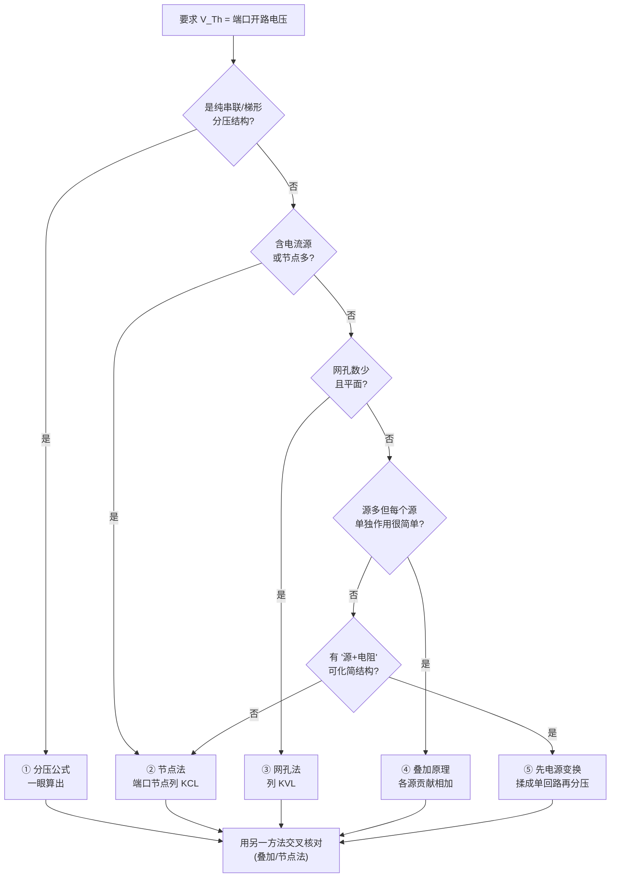

---
tags:
  - 电路学
  - 基本定律
  - 电路分析方法
  - 课程笔记
date: 2026-08-15
aliases:
  - 戴维南定理
  - 戴维南等效
  - 戴维南
  - 戴维宁定理
  - Thevenin's Theorem
  - Thevenin Theorem
  - Thevenin
---

# 戴维南定理 (Thevenin's Theorem)

> [!IMPORTANT] 核心定义
> 任何一个**线性二端网络**，对其外部负载而言，都可以等效为一个**理想电压源 $V_{Th}$ 与一个电阻 $R_{Th}$ 串联**的二端网络。
> - $V_{Th}$ = 二端网络的开路电压（$V_{oc}$）
> - $R_{Th}$ = 从端口看进去的等效电阻（独立源置零后）
> 戴维南定理与 [[Norton's Theorem|诺顿定理]] 是同一对偶关系，共同构成**线性电路等效分析**的核心工具。

---

## 一、适用前提

> [!NOTE] 线性电路 (Linear Circuit)
> 戴维南定理**只对线性二端网络成立**——由线性元件（电阻/电容/电感）与线性受控源、独立源构成。含二极管、晶体管等非线性元件的网络**不能直接**用戴维南等效（除非先做 [[Small Signal Analysis|小信号分析]] 线性化）。

### 1.1 动机：为什么需要戴维南 (Motivation)

> [!IMPORTANT] 课件给出的动机（很值得记住）
> **很多电路里，只有一个元件是"会变的"，其余都是固定的。**
> 这个可变的元件叫**负载 (load)**。既然如此——
> **我们不应该每换一个负载就把整个电路重算一遍。**
>
> 戴维南定理正是为此而生：把**固定的那部分**电路整体替换成一个
> **电压源 $V_{Th}$ 串一个电阻 $R_{Th}$**。

- 换了负载 $R_L$，只需在"$V_{Th}$ 串 $R_{Th}$"上重新分压/分流一次
- 于是**负载电流 = 一个电压源 + 两个串联电阻**的简单问题，负载电压直接用分压公式
- 这正是"等效"的工程价值：**把重复计算变成一次计算 + 反复套用**

---

## 二、求解步骤 (Procedure)

1. **断开负载**：将待求的负载（或关注支路）从二端网络中分离出来。
2. **求开路电压 $V_{oc}$**：端口开路时，求两端电压，即 $V_{Th} = V_{oc}$。**—— 方法见 §2.1**
3. **求等效电阻 $R_{Th}$**：三种方法（见 §三）。
4. **画出等效电路**：$V_{Th}$ 与 $R_{Th}$ 串联后，接回负载求解。

### 2.1 求 $V_{Th}$ 的五种方法（重点）

> [!IMPORTANT] 第一步先想清楚一件事
> $V_{Th}$ 就是**端口开路时的端电压**，而且它是**带符号的代数量**——
> 有大小、有极性（正负取决于你标注的参考方向）。
> 所以动手前必须先做两件事：
> 1. **标清参考方向**（$v_{Th}$ 的"+"端定在哪一边）
> 2. **确认端口真的"开路"**（负载已断开、没有电流流过端口）
>
> 常见失分点不是"不会算"，而是**参考方向没定好，最后符号反了**。

| 方法 | 适用拓扑 | 核心动作 | 难度 |
| :--- | :--- | :--- | :--- |
| **① 直接分压/分流** | 单回路、串并联、梯形 | 端口电压 = 分压器输出 | ★ |
| **② 节点法 (Nodal)** | 任意，尤其多节点/含电流源 | 以端口为未知节点列 KCL | ★★ |
| **③ 网孔法 (Mesh)** | 平面、网孔少 | 设网孔电流，求端口电压 | ★★ |
| **④ 叠加原理** | 源多但每个源单独作用时很简单 | 各源单独贡献代数相加 | ★★ |
| **⑤ 电源变换辅助** | 含"源 + 串/并联电阻"结构 | 先化简再求端口电压 | ★★ |

> [!TIP] 反向路径：有时候先求 $I_{sc}$ 更省事
> $V_{Th}$ 与 $I_{sc}$ 之间只隔一个 $R_{Th}$：
> $$V_{Th} = I_{sc}\cdot R_{Th}$$
> 所以**不必死守"必须先求 $V_{oc}$"**。如果端口短路后电路明显更好算
> （比如短路线把一堆元件旁路掉、或端口两节点被短接后直接变成简单并联），
> 那就**先求 $I_{sc}$**，再用 §三 的 $R_{Th}$ 反推 $V_{Th}$。
>
> 这就是课件强调的：**"三个量（$V_{oc}$、$I_{sc}$、$R_{eq}$）挑两个最好算的，
> 第三个用欧姆定律补出来。"**

**① 直接分压/分流**——最省事，遇到就先用

单回路或纯串联分压结构时，$V_{Th}$ 一眼可得。例如经典的分压网络（**见 §七 典型示例**）：

$$V_{Th} = V_s\frac{R_2}{R_1+R_2}$$

**② 节点法 ⭐ 最通用**

把**端口的一端（通常是你定义 $v_{Th}$ 正极的那端）当作一个未知节点**，另一端接地，
对该节点列 KCL，解出的节点电压**就是** $v_{Th}$。要点：

- 端口开路 ⇒ **该节点没有外接电流**，KCL 里不出现"流出端口的电流"项
- 含电流源时节点法尤其顺手（电流源直接进方程右端）
- 有多个未知节点时联立求解，最后取端口两点电压之差

**③ 网孔法**

对每个网孔设电流、列 KVL，然后写 $v_{Th}$ = 端口两端沿路径的电压之和。
**课件的完整数值例题就是用网孔法**（见下方）。

**④ 叠加原理**——源多但结构简单时最快
$$V_{Th} = \sum_k (\text{第 } k \text{ 个独立源单独作用时端口开路电压})$$
每次只留一个源，其余按"电压源短路、电流源开路"置零，**受控源保留**。

**⑤ 电源变换先化简，再求端口电压**

先消掉与理想源并联/串联的多余元件，把网络揉成单回路，再分压。见 [[Source Transformation|电源变换]]。

#### 课件例：用网孔法求 $V_{Th}$

![[l3_thevenin_direct.png]]

电路含 $32\text{ V}$ 电压源、$4\,\Omega$ 与 $12\,\Omega$ 电阻，以及一个受控源。按步骤：

**第一步：断开负载，标出端口**

端口处的 $12\,\Omega$ 是**被观察的负载**（不是网络内部），端口电压即 $v_{Th}$。

**第二步：设网孔电流，列 KVL**（两网孔，$i_2 = -2\text{ A}$ 由电流源强制给定）

$$-32 + 4i_1 + 12(i_1-i_2) = 0 \;\Longrightarrow\; 4i_1 - 3i_2 = 8$$

代入 $i_2=-2$：

$$4i_1 + 6 = 8 \;\Longrightarrow\; i_1 = 0.5\ \text{A}$$

**第三步：由网孔电流写出端口电压**

$$v_{Th} = 12(i_1 - i_2) = 12\,(0.5+2) = \boxed{30\ \text{V}}$$

> [!TIP] 三条实用经验
> 1. **能用节点法就用节点法**——端口节点天然是"一个未知数"，KCL 一次搞定；
>    网孔法要设多个网孔电流再组合，步骤更多。
> 2. **算完立刻用另一个方法核对**。上例用 [[Superposition Theorem|叠加]] 验证：
>    32 V 源单独作用时 $v_a = 32\times\frac{12}{4+12}=24$ V，
>    2 A 源单独作用时 $v_b = 2\times(4\parallel 12)=6$ V，
>    合计 $24+6 = \boxed{30\ \text{V}}$ ✓ **两法一致才敢往下走**。
> 3. **$v_{Th}$ 的正负是"信息"不是"错误"**：算得负值只说明实际极性与你的参考方向相反
>    （见 §4.3 的负 $v_{Th}$ 例题）。

> [!WARNING] 三个高频错误
> 1. **忘了"断开负载"就求电压**：若负载还在，你求到的是**带载电压**，不是 $V_{Th}$。
> 2. **把"与短路线并联的元件"带进开路计算**：短路时被旁路的支路（课件例题里那句
>    "5 Ω is immaterial"）在**开路时是有效的**，必须重新纳入。两种极端条件不能混用结论。
> 3. **受控源置零**：受控源必须保留；但要注意**开路会改变控制量的值**，需要重新计算控制量，
>    不能沿用短路条件下的数值。

---

## 三、求 $R_{Th}$ 的三种方法

### 方法 1：独立源置零法（无受控源时）

将网络内所有**独立源置零**（电压源→短路、电流源→开路），**受控源保留**，然后从端口求等效电阻。

$$R_{Th} = R_{eq} \Big|_{\text{独立源置零}}$$

### 方法 2：短路电流法

若 $V_{oc}$ 已知，将端口短路求出短路电流 $I_{sc}$，则：

$$R_{Th} = \frac{V_{oc}}{I_{sc}}$$

### 方法 3：测试源法（含受控源时 ⭐）

> [!WARNING] 含受控源必须用测试源法
> 受控源不能置零，此时"独立源置零法"失效。正确做法：独立源置零后，在端口外加一个**测试电压源 $v_{test}$**（或测试电流源 $i_0$），求出流入端口的电流 $i_{test}$（或端电压 $v_0$）：
> $$R_{Th} = \frac{v_{test}}{i_{test}} \qquad\text{或}\qquad R_{Th} = \frac{v_0}{i_0}$$

**课件对三类方法的完整演示**（同一个电路，三种做法）：

![[l3_thevenin_direct.png]]

- **直接法 (direct method)**：先求 $V_{Th}=V_{oc}$，再求 $I_{sc}$，用 $R_{Th}=V_{Th}/I_{sc}$ 收口
- **替代法 (alternative method)**：独立源置零后直接求端口输入电阻 $R_{in}=R_{Th}$

![[l3_thevenin_test.png]]

- **测试源法**：(a) 先求开路电压 $v_{Th}$；(b) 用测试电压源 $v_o$ 激励网络求 $i_o$，则 $R_{Th}=v_o/i_o$

> [!NOTE] 选哪个方法
> 课件给的建议很实用：**三个量（$V_{oc}$、$I_{sc}$、$R_{eq}$）中挑两个"算起来最省事"的，
> 第三个用欧姆定律补出来。** 不要死守某一种方法。

---

## 四、与诺顿定理的关系（源变换）

> [!NOTE] 戴维南 ↔ 诺顿对偶
> 诺顿定理：线性二端网络可等效为**电流源 $I_N$ 与电阻 $R_N$ 并联**。
> 两者关系：
> $$R_N = R_{Th}, \qquad I_N = I_{sc} = \frac{V_{Th}}{R_{Th}}$$

| 定理 | 等效形式 | 参数 |
| :--- | :--- | :--- |
| 戴维南 Thevenin | 电压源 $V_{Th}$ **串联** $R_{Th}$ | $V_{Th} = V_{oc}$ |
| 诺顿 Norton | 电流源 $I_N$ **并联** $R_N$ | $I_N = I_{sc}$、$R_N = R_{Th}$ |

> [!TIP] 源变换 (Source Transformation)
> 电压源 $V$ 串联 $R$，可变换为电流源 $\dfrac{V}{R}$ 并联 $R$，反之亦然。这是电路简化中极为常用的技巧。

### 4.1 端口的 i–v 线性关系（从叠加性导出）

戴维南等效不是凭空定义的，它直接来自**线性电路的叠加性**。对一个线性二端网络，任取端口电压 $v$ 与端口电流 $i$（关联参考方向），令所有独立源置零时的端口等效电阻为 $R_{Th}$。由叠加原理：
>- 仅由**内部独立源**贡献（端口开路 $i=0$）→ 开路电压 $V_{oc}=V_{Th}$；
>- 仅由**外部端口电流** $i$ 贡献（独立源置零）→ 在 $R_{Th}$ 上产生压降 $R_{Th}\,i$。
>
> 两者相加即得端口特性：
> $$ v = V_{Th} - R_{Th}\,i \quad \text{或等价写作} \quad v = V_{Th} + R_{Th}\,i \;(\text{取 } i \text{ 流出端口为正}) $$
> 这是一条**斜率为 }-R_{Th}$（或 $R_{Th}$）的 i–v 直线**，横轴截距为 $V_{Th}$（开路点），纵轴截距为 $-I_{sc}$（短路点，$I_{sc}=V_{Th}/R_{Th}$）。

![[source_equivalence_iv.svg]]

> [!NOTE] 戴维南与诺顿描述同一条直线
> 上图同时画出**戴维南（串联）**与**诺顿（并联）**两种内部构造：它们在外部端口看到的 i–v 直线**完全相同**——只是用"电压源串电阻"或"电流源并电阻"两种不同内部实现来等效。这正是源变换的物理含义。

### 4.2 端口 i–v 直线与"等效三条件"

既然端口特性是一条直线 $v_o = v_{Th} - i_oR_{Th}$，它就由**两个参数**决定。课件由此给出**两个线性电路等效的判据**（详见 [[Source Transformation|电源变换 §三]]）：

| 检查项 | 几何含义 | 提供参数 |
| :--- | :--- | :--- |
| 独立源置零后**端口电阻**相同 | 直线**斜率** | $R_{Th}$ |
| **开路电压**相同 | $v$ 轴**截距** | $v_{Th}$ |
| **短路电流**相同 | $i$ 轴**截距** | $v_{Th}/R_{Th}$ |

**任意两条即可确定这条直线。** 实务上有个更省事的推论：由于戴维南定理保证任何线性二端网络在端口都呈现"源 + 阻"形式，**检查等效时往往只需核对端口等效电阻一项**——其余由定理自动保证。

### 4.3 负的 $R_{Th}$ 与负的 $V_{Th}$（含受控源的反直觉现象）

> [!IMPORTANT] 课件专门提出的问题
> **等效电路的结果可能是负电阻吗？答案是：可能。**
> "It is possible to get a negative Thévenin resistance (**or voltage**).
> This is reasonable **with dependent sources**."
>
> 直觉解释：**受控源可以从外部电源"吸取"能量再注入电路**，
> 相当于给端口提供了**负的损耗**。这正是振荡器、负阻器件（如隧道二极管）的电路基础。

**例 1：负 $R_{Th}$**（电路内**没有**独立源，故 $v_{Th}=0$）

![[l3_negative_rth.jpeg]]

- 求 $R_{Th}$ 的方法：**外加测试电流源 $i_o$**，对节点 a 列 KCL
  $$2i_x + \frac{v_o}{4} + \frac{v_o}{2} - i_o = 0 \;\Longrightarrow\; 2i_x + \frac{3}{4}v_o = i_o$$
- 受控源约束：$i_x = \dfrac{0-v_o}{2} = -\dfrac{v_o}{2}$
- 代入解得
  $$R_{Th} = \frac{v_o}{i_o} = \boxed{-4\ \Omega}$$
- **物理含义**：负的戴维南电阻意味着**该电路在向外提供功率**（能量来自受控源所代表的
  有源器件），而不是消耗功率。

**例 2：负 $V_{Th}$**（答案为 $R_{Th}=100\ \Omega$、$V_{Th}=-5$ V）

![[l3_negative_vth.jpeg]]

- 开路条件下：$i = 5 - 3v$ 与 $20i + v - 25 = 0$ 联立 ⇒ $v_{Th} = v = -5$ V
- 短路条件下求出 $i = \frac{1}{400}$ A，于是
  $$R_{Th} = \frac{v_{Th}}{-20i} = 100\ \Omega$$
- **负的开路电压**只表示**端口的实际极性与你假定的参考方向相反**，不是"不存在"。

> [!WARNING] 负电阻的两个理解误区
> 1. **不要以为算错了**。含受控源时负 $R_{Th}$ 是**数学上正确且物理上可实现**的结果。
> 2. **它不违反能量守恒**。负阻区域局部在释放能量，但这部分能量来自电路中的**有源器件**
>    （受控源是理想化模型，背后是真实的放大器/晶体管与它的供电电源）。

---

## 五、为什么它成立：用叠加原理推导 (Derivation)

戴维南/诺顿定理不是"经验规则"，它们是**叠加原理的必然结果**。课件给出了完整推导。

> [!IMPORTANT] 推导思路（三步）
> 1. 要给等效电路，就必须让**端口 a–b 的 i–v 关系相同**。
> 2. 在端口**外加一个电流源** $i$ 作为激励，用**叠加原理**写出端口电压。
> 3. 把来自**内部独立源**的贡献打包成一个常数 $C_1$，就得到了"源 + 阻"的形式。

![[l3_derivation_thevenin.jpeg]]

设电路内有独立电压源 $v_{sj}$（$j=1,\dots,m$）与独立电流源 $i_{sk}$（$k=1,\dots,n$）。
以端口电流 $i$ 为激励，由叠加原理，端口电压可写成：

$$
v = C_0\,i + \sum_{j=1}^{m} A_j v_{sj} + \sum_{k=1}^{n} B_k i_{sk}
$$

其中 $A_j, B_k$ 是常数（由网络拓扑与元件值决定）。把**内部独立源的全部贡献**记为一个常数：

$$
C_1 = \sum_{j} A_j v_{sj} + \sum_{k} B_k i_{sk}
\qquad\Longrightarrow\qquad
v = C_0\,i + C_1
$$

**识别两个常数：**

- **端口开路**（$i = 0$）：$v = C_1 = v_{oc} = V_{Th}$ —— 常数项就是**开路电压**
- **内部独立源置零**（"死网络"）：$v = C_0\,i$，而由欧姆定律 $v = iR_{eq}$，故
  $C_0 = R_{eq} = R_{Th}$

于是得到

$$
\boxed{\,v = R_{Th}\,i + V_{Th}\,}
$$

这正是"电压源 $V_{Th}$ 串电阻 $R_{Th}$"的端口特性——**戴维南定理得证**。∎

> [!NOTE] 诺顿定理的对称推导
> 换成在端口**外加一个电压源** $v$ 作激励，用同样的叠加论证可得电流形式：
> $$i = D_0\,v + D_1$$
> - $D_1$ 是**内部独立源**对 $i$ 的贡献 ⇒ 端口短路时 $i = D_1 = i_{sc} = I_N$ —— **诺顿电流**
> - 置零外部激励后 $i = D_0 v$，而 $D_0 = \frac{1}{R_{eq}}$ ⇒ $i = \frac{v}{R_N} + I_N$，
>   即"电流源 $I_N$ 并电阻 $R_N$"。

![[l3_derivation_norton.jpeg]]

> [!TIP] 这个推导的深远意义
> **它把"等效电路"从技巧提升为定理**：只要电路线性，端口 i–v 就必然是直线，
> 而直线只由两个参数刻画——所以**两参数等效总是存在**。
> 这也是 §4.3 负 $R_{Th}$ 能出现的根本原因：$C_0 = R_{Th}$ 是**解方程得到的系数**，
> 受控源可以让它为负，而数学上毫无矛盾。
>
> 顺带回答了一个疑问：**为什么"独立源置零求电阻"和"短路电流法"总能给出同一个 $R_{Th}$**？
> 因为它们分别是这条直线的**斜率**和**两个截距的比**，本来就指向同一个参数。

---

## 六、注意事项 (Pitfalls)

> [!WARNING] 三个常见误区
> 1. **受控源不能置零** —— 求 $R_{Th}$ 时只有独立源能短路/开路。
> 2. **只对外等效，对内不等效** —— 戴维南等效电路与原网络在**端口处**电压-电流关系一致，但**网络内部**的功率、损耗不能由等效电路反推。
> 3. **功率不能叠加/等效换算** —— 负载功率 $P = \dfrac{V^2}{R}$ 是二次量，必须先求负载实际电压/电流，再算功率；不能直接用各等效源分别算功率再相加。

---

## 七、典型示例

> [!EXAMPLE] 例题
> 电压源 $V_s = 10\text{ V}$ 与电阻 $R_1 = 2\,\Omega$、$R_2 = 3\,\Omega$ 串联，求从 $R_2$ 两端看进去的戴维南等效，并求负载 $R_L = 5\,\Omega$ 上的电流。

**原始电路（分压网络）：**

![[thevenin_original.svg|120]]

**步骤 1 求 $V_{Th}$**：断开 $R_2$（作为负载），求端口开路电压，即 $R_1$ 对 $R_2$ 的分压：
$$V_{Th} = V_{oc} = V_s \cdot \frac{R_2}{R_1 + R_2} = 10 \cdot \frac{3}{2+3} = 6\text{ V}$$

**步骤 2 求 $R_{Th}$**：独立源置零（$V_s$ 短路），从端口向内看：

![[thevenin_rth.svg|302]]

短路线把 $V_s$ 两端连成一点，等效为导线。$R_2$ 已被断开作为负载，不属于网络内部。因此从 A-B 端口向内看，只剩下 **$R_1$ 直接接在 A-B 之间**：
$$R_{Th} = R_1 = 2\,\Omega$$

**步骤 3 接回 $R_L = 5\,\Omega$：**
$$I_L = \frac{V_{Th}}{R_{Th} + R_L} = \frac{6}{2 + 5} = \frac{6}{7} \approx 0.857\text{ A}$$

---

## 相关笔记

- [[Superposition Theorem]] —— 线性电路可叠加性（戴维南/诺顿的理论基石，§五 的推导就基于它）
- [[Source Transformation|电源变换]] —— 戴维南⇄诺顿 是它的特例；等效三条件的完整讨论
- [[Norton's Theorem]] —— 对偶定理
- [[Maximum Power Transfer Theorem]] —— 最大功率传输（戴维南等效的直接应用）
- [[Kirchhoff's Laws]] —— 求解 $V_{oc}$、$I_{sc}$ 的基础工具
- [[Lumped Matter Discipline]] —— 集总电路模型的理论前提
- [[Circuit Theory Glossary]] —— 电路理论术语表
- [[cs6.002x.1]] —— 电路原理知识树（主笔记）
